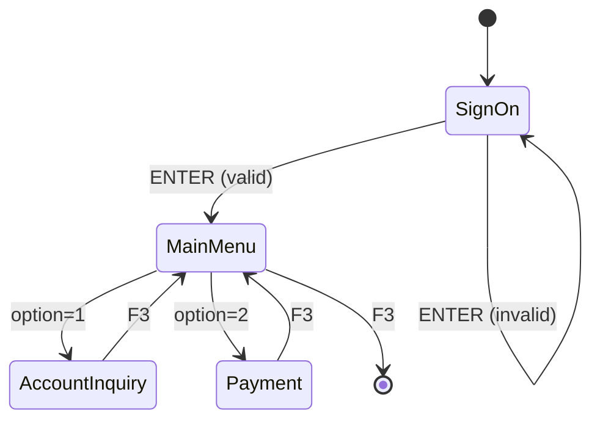

# Phase 3: BMS Map Analysis → Screen Navigation & REST API

## Objective

Analyze BMS map files and map CICS screens to REST API endpoints. Generate BMS ASCII layouts and screen navigation state diagrams.

## Input

- BMS source files (.bms)
- COBOL programs that reference BMS maps
- Screen navigation information from program logic

## Deliverables

### 3.1 `03-bms-analysis/bms-map-analysis.md`

```markdown
# BMS Map Analysis

## BMS Map Inventory

| # | Mapset | Map Name | Screen Purpose | Fields | Referenced By |
|---|--------|----------|---------------|--------|--------------|
| 1 | [mapset] | [mapname] | [purpose] | [N] | [program list] |

## Field Mapping: BMS → REST API

| Field Name | BMS Type | Data Type | Length | Required | Protect | API Parameter |
|------------|---------|-----------|--------|----------|---------|--------------|
| [field] | DFHMDF | [type] | [N] | Y/N | Y/N | [paramName] |

## Screen Navigation Flow

(Context from CICS program logic)

| From Screen | Action (PF Key) | Condition | To Screen | HTTP Method |
|-------------|-----------------|-----------|-----------|-------------|
| [name] | ENTER | [condition] | [name] | POST |
| [name] | F3 | No check | Main Menu | GET |
| [name] | F7 | More pages | Page backward | GET |
| [name] | F8 | More pages | Page forward | GET |
```

### 3.2 `03-bms-analysis/screen-navigation-state-machine.md` (if enabled)

```markdown
# Screen Navigation State Machine

(Content includes Mermaid state diagram showing all screen states and PF-key transitions)


```

### 3.3 ASCII Screen Layouts (if enabled)

For each BMS map, generate an ASCII reproduction:

```
+--------------------------------------------------------------------+
|  [Date]                                          APPLICATION SCREEN  |
|                                                                      |
|  Account Number: [________]    Card Number: [________________]      |
|  Customer Name : [________________________________________]          |
|                                                                      |
|  Current Balance: $_____.__    Credit Limit: $_______.__             |
|                                                                      |
|  Status: [A]ctive  [I]nactive  Acct Type: [__]                      |
|                                                                      |
|  F1=Help    F3=Exit    F5=Refresh    F8=Forward    F12=Cancel       |
+--------------------------------------------------------------------+
```

## BMS Attribute Mapping

| BMS Attribute | Meaning | REST API Behavior |
|--------------|---------|-------------------|
| UNPROT | Unprotected (input) | RequestBody field |
| PROT | Protected (output only) | Response field only |
| ASKIP | Skip field | Read-only (ignored in input) |
| BRIGHT | Highlighted | UI: bold/highlight |
| NORM | Normal intensity | UI: normal weight |
| DARK | Non-display | UI: hidden |
| MODIFIED | Data may change | Track dirty flag |
| IC | Insert cursor (position) | UI: autofocus |
| FSET | MDT on | Always transmit |
| LENGTH=N | Field byte length | JPA: `@Column(length=N)` + DTO: `@Size(max=N)` |

## BMS → REST API Mapping Rules

1. **UNPROT fields** → `@RequestBody` DTO fields
2. **PROT fields** → Response DTO fields (server generated)
3. **ASKIP fields** → Response fields (read-only)
4. **BRIGHT fields** → UI highlighted (document in API docs)
5. **DARK fields** → Hidden field (may still send value)
6. **MDT (Modified Data Tag)** → FSET → Always include in request
7. **LENGTH=N** → `@Column(length=N)` on JPA Entity field + `@Size(max=N)` on DTO field; numeric fields use LENGTH to derive `@Column(precision=N, scale=M)`

## SEND MAP → Response

| CICS SEND MAP pattern | REST |
|----------------------|------|
| First-time (MAPONLY) | GET endpoint (initial screen structure) |
| After validation fail | POST response with error fields (HTTP 400) |
| After processing complete | POST response with success message (HTTP 200) |

## PF Key → HTTP Endpoint

From `references/cobol-to-java-mappings.md` PF Key table:

| PF Key | HTTP Method | Action |
|--------|-------------|--------|
| ENTER / F5 | POST | Process form data (main action) |
| F3 | GET | Return to parent (always available) |
| F7 | GET | Previous page (pagination) |
| F8 | GET | Next page (pagination) |
| F12 | DELETE/GET | Cancel (return to previous screen) |

## Execution Steps

### Step 1: Identify All BMS Files

1. List all .bms files found during Phase 1 discovery
2. Classify by purpose: signon, menu, inquiry, maintenance, scrollable list, etc.
3. Map each to COBOL program(s) that reference it

### Step 2: Decompose Each Map

For each BMS map:
1. Identify the MAPSET + MAP name
2. Decompose each DFHMDF field:
   - Field name + label
   - Length (PIC clause)
   - Attribute byte (PROT/UNPROT/ASKIP)
   - MDT setting
   - Cursor position
3. For DFHMDF fields with 88-level conditions in COPYBOOK, note enum mapping

### Step 3: Extract Screen Navigation

From program logic analysis:
1. Identify all XCTL/LINK destinations (screen transitions)
2. Map PF key to transition:
   - F3 = Return to parent screen
   - F7/F8 = Scroll (pagination)
   - ENTER = Submit (main action)
   - F5 = Refresh
3. Build state machine

### Step 4: Generate ASCII Layouts (if enabled)

For each BMS map, generate ASCII representation:
1. Include screen title (from DFHMDF with BRIGHT)
2. Box UI borders with +,-,| characters
3. Label (PROT) fields on left
4. Input (UNPROT) fields as underscores
5. Function key legend at bottom

### Step 5: Export BMS Analysis

Write `03-bms-analysis/bms-map-analysis.md`
Write `03-bms-analysis/screen-navigation-state-machine.md` (if enabled)

## Quality Gate

- [ ] All .bms files decomposed
- [ ] All DFHMDF fields mapped to REST fields
- [ ] PROT/UNPROT/ASKIP correctly mapped to Request/Response
- [ ] Screen navigation flow complete with PF key transitions
- [ ] Mermaid state diagram auto-generated and verified rendering
