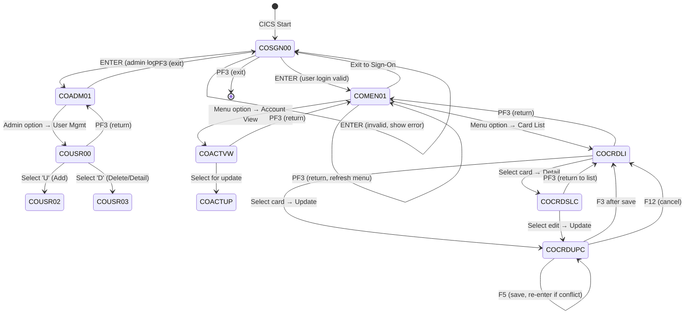

# Phase 3: BMS Map Analysis → Screen Navigation & REST API

## Objective

Analyze EVERY BMS map file in the project. Extract every DFHMDF field with its attributes, map to REST API DTOs, and build a complete screen navigation state machine. This phase MUST analyze ALL BMS maps — no shortcuts regardless of count.

## Input

- ALL BMS source files (.bms)
- COBOL programs that reference BMS maps (COPY statements + map usage)
- COPYBOOK definitions for field context

## Deliverable Precision Standard

For a project with N BMS maps, the output MUST contain N individual map analyses. If N > 10, split into multiple files (`bms-map-analysis-part1.md`, `bms-map-analysis-part2.md`, etc.). Each map analysis is considered INCOMPLETE if it lacks any of the following:

1. All DFHMDF fields listed with exact name, row/column, length, PIC, attribute
2. UNPROT → Request DTO field mapping with validation
3. PROT/ASKIP → Response DTO field mapping
4. PF key handling (which key triggers what transition)
5. CommArea data flow (what data enters the screen, what data leaves)
6. Source BMS file path and line range

## Deliverables

### `03-bms-analysis/bms-map-analysis.md`

```markdown
# BMS Map Analysis

## BMS Map Inventory

| # | Mapset File | Map Name | Program | Screen Purpose | DFHMDF Count | Complexity |
|---|------------|----------|---------|---------------|-------------|-----------|
| 1 | COSGN00.bms | COSGN00A | COSGN00C | Sign-On | 12 | Low |
| 2 | COMEN01.bms | COMEN01A | COMEN01C | Dynamic Menu | 15+options | Medium |

---

## Per-Map Analysis (REPEAT this section for EVERY BMS map)

### Map: [MAPSET]/[MAPNAME]

**Source:** `[mapset].bms`, lines [N]-[M]
**Referenced By:** `[program].cbl`
**Screen Purpose:** [1-2 sentences from program header comments]

#### ASCII Layout

```
+--------------------------------------------------------------------+
|  [Date]                                          [TITLE]            |
|                                                                      |
|  [PROT label]: [UNPROT input field (IC=cursor)]                     |
|                                                                      |
|  F1=Help    F3=Exit    F5=Save    F12=Cancel                       |
+--------------------------------------------------------------------+
```

#### Field Inventory (DFHMDF)

| # | Field Name | Row | Col | PIC/Length | Attribute | MDT | IC | Purpose | Java Type | DTO Field |
|---|-----------|-----|-----|------------|-----------|-----|----|---------|-----------|-----------|
| 1 | [FIELD]O | 2 | 1 | X(40) | PROT, BRIGHT | No | No | Title | String | — (header) |
| 2 | [FIELD]I | 5 | 20 | X(08) | UNPROT | Yes | Yes | User ID input | String | userId |
| 3 | [FIELD]I | 6 | 20 | X(08) | UNPROT, PASSWORD | Yes | No | Password input | String | password |
| 4 | [FIELD]O | 8 | 1 | X(80) | PROT, BRIGHT | No | No | Error message | String | errorMessage |

#### PF Key Handling

| PF Key | Source Program Line | Action | Target Screen | HTTP Equivalent |
|--------|--------------------|--------|--------------|-----------------|
| ENTER | [program.cbl]:[line] | Process login | MainMenu (if valid) / Same (if invalid) | POST /api/v1/auth/login |
| PF3 | [program.cbl]:[line] | Exit | Sign-On / Return to CICS | GET /api/v1/auth/logout |
| PFx | [program.cbl]:[line] | [action] | [target] | [method] [endpoint] |

#### Input Field → Request DTO Mapping

| UNPROT Field | PIC | Bean Validation | Request DTO Field | Required | Source |
|-------------|-----|----------------|------------------|----------|--------|
| USERIDI | X(08) | @NotBlank, @Size(max=8) | userId | Yes | [bms]:[line] |
| PASSWDI | X(08) | @NotBlank, @Size(max=8) | password | Yes | [bms]:[line] |

#### Output Field → Response DTO Mapping

| PROT Field | PIC | Source Data | Response DTO Field | Source |
|-----------|-----|------------|-------------------|--------|
| ERRMSGO | X(80) | WS-MESSAGE | errorMessage | [program.cbl]:[line] |
| TITLE01O | X(40) | CCDA-TITLE01 | title | [copybook]:[line] |
| CURDATEO | X(08) | WS-CURDATE | currentDate | [program.cbl]:[line] |

#### CommArea Data Flow

**Data Received (from calling program):**
| CommArea Field | Source Program | Purpose |
|---------------|---------------|---------|
| CDEMO-USER-ID | COSGN00C | Pass user ID to next screen |

**Data Sent (to called program via XCTL):**
| CommArea Field | Target Program | Purpose |
|---------------|---------------|---------|
| CDEMO-USER-ID | COADM01C/COMEN01C | User context for menu |
| CDEMO-USER-TYPE | COADM01C/COMEN01C | Role for access control |
| CDEMO-PGM-CONTEXT | COADM01C/COMEN01C | First entry vs re-entry |

#### Business Rules Embedded in Screen

| # | Rule | How Enforced | Source Line |
|---|------|-------------|------------|
| 1 | User ID required | IF USERIDI = SPACES → error | [cbl]:[line] |
| 2 | Password required | IF PASSWDI = SPACES → error | [cbl]:[line] |
| 3 | [rule] | [how] | [cbl]:[line] |

#### Pagination Pattern (if applicable — list screens)

| Aspect | Value |
|--------|-------|
| Page Size | [N] records |
| Cursor Mechanism | [STARTBR key / first-id / last-id] |
| PF7 (Backward) | [readprev from key] |
| PF8 (Forward) | [readnext from key] |
| CommArea Page State | [fields that track page number, first/last key] |
| Source Lines | [program.cbl]:[start]-[end] |

---

(Repeat above section for each BMS map)
```

### `03-bms-analysis/screen-navigation-state-machine.md`

Complete Mermaid state diagram covering ALL screens:



### `03-bms-analysis/screen-navigation-flow-detail.md` (NEW — for complex screens)

For each screen with multi-step interactions (CRUD forms, pagination, wizards):

```markdown
## [Screen Name] — Detailed Interaction Flow

### State Machine
| State | Entry Condition | User Action | Exit Condition | Next State |
|-------|----------------|-------------|---------------|-----------|
| INITIAL | EIBCALEN=0 | — | — | DISPLAY_BLANK |
| DISPLAY_BLANK | First entry | ENTER | Input received | VALIDATE |
| VALIDATE | Input received | — | Validation pass | PROCESS |
| VALIDATE | Input received | — | Validation fail | DISPLAY_ERROR |
| DISPLAY_ERROR | Validation fail | Correct input → ENTER | Validation pass | PROCESS |
| PROCESS | Valid input | — | DB operation success | DISPLAY_SUCCESS |
| PROCESS | Valid input | — | DB operation fail (lock) | DISPLAY_CONFLICT |
```

## BMS Attribute Mapping

| BMS Attribute | Meaning | REST API Behavior |
|--------------|---------|-------------------|
| UNPROT | Unprotected (input) | RequestBody field |
| PROT | Protected (output only) | Response field only |
| ASKIP | Skip field (read-only input area) | Read-only (ignored in input) |
| BRIGHT | Highlighted | UI: bold/highlight |
| NORM | Normal intensity | UI: normal weight |
| DARK | Non-display | UI: hidden |
| MODIFIED | Data may change | Track dirty flag |
| IC | Insert cursor (position) | UI: autofocus |
| FSET | MDT on | Always transmit |
| LENGTH=N | Field byte length | JPA: `@Column(length=N)` + DTO: `@Size(max=N)` |

## BMS → REST API Mapping Rules

1. **UNPROT fields** → `@RequestBody` DTO fields with `@Valid` and Bean Validation
2. **PROT fields** → Response DTO fields (server-generated values only)
3. **ASKIP fields** → Response fields (read-only display, may appear in both Request and Response)
4. **BRIGHT fields** → UI highlighted (document in API docs)
5. **DARK fields** → Hidden field (may still send value, do not omit from DTO)
6. **MDT (Modified Data Tag)** → FSET → Always include in request
7. **LENGTH=N** → `@Column(length=N)` on JPA Entity field + `@Size(max=N)` on DTO field; numeric fields use LENGTH to derive `@Column(precision=N, scale=M)`
8. **PF3 on ALL screens** → Must map to a "back" or "cancel" endpoint (HTTP GET)
9. **PF7/PF8 pagination** → Must map to cursor-based pagination (NOT offset-based), using key-based navigation

## SEND MAP → Response

| CICS SEND MAP pattern | REST |
|----------------------|------|
| First-time (MAPONLY) | GET endpoint (initial screen structure) |
| After validation fail | POST response with error fields (HTTP 400) |
| After processing complete | POST response with success message (HTTP 200) |
| ERASE option | Clear previous data → new response body |
| NO ERASE option | Preserve previous data → partial update |

## PF Key → HTTP Endpoint

| PF Key | HTTP Method | Action |
|--------|-------------|--------|
| ENTER / F5 | POST | Process form data (main action) |
| F3 | GET | Return to parent (always available) |
| F7 | GET | Previous page (cursor-based pagination) |
| F8 | GET | Next page (cursor-based pagination) |
| F12 | GET | Cancel (return to previous screen without saving) |

## Execution Steps

### Step 1: Identify ALL BMS Files

1. List all .bms files found during Phase 1 discovery
2. Count total maps across all mapsets (one .bms may contain multiple MAP definitions)
3. Map each to COBOL program(s) that reference it (via COPY statement)

### Step 2: Decompose EVERY Map (NO SHORTCUTS)

For each BMS map:
1. Extract MAPSET name, MAP name from DFHMSD/DFHMDI headers
2. Extract EVERY DFHMDF field: name, POS(row,col), PIC, ATTRB(PROT/UNPROT/ASKIP/BRIGHT/DARK), IC, FSET, INITIAL
3. Classify each field: Input (UNPROT), Output (PROT/BRIGHT), Header/Label, Error message
4. Note cursor position (IC) — maps to HTML autofocus

### Step 3: Extract PF Key Handling from Source Programs

For each program that uses a BMS map:
1. Find EVALUATE EIBAID block
2. List EVERY WHEN clause (DFHENTER, DFHPF3, DFHPF7, etc.)
3. For each WHEN: what happens (XCTL, RETURN, page forward/back, validation)
4. Source line number for each branch

### Step 4: Extract Screen Navigation Flow

From program logic analysis (Phase 5 output):
1. Identify all XCTL/LINK destinations (screen transitions)
2. Map PF key to transition:
   - F3 = Return to parent screen
   - F7/F8 = Scroll (cursor-based pagination)
   - ENTER = Submit (main action)
   - F5 = Refresh / Save
3. Build complete state machine (Mermaid)

### Step 5: Map Fields to DTOs

For each map:
1. Create Request DTO from ALL UNPROT fields (with Bean Validation)
2. Create Response DTO from ALL PROT/BRIGHT fields
3. Map field names: BMS convention (e.g., `TRNID01I`) → Java convention (e.g., `transactionId`)
4. Document the mapping rule used

### Step 6: Export BMS Analysis

Write `03-bms-analysis/bms-map-analysis.md`
Write `03-bms-analysis/screen-navigation-state-machine.md`
Write `03-bms-analysis/screen-navigation-flow-detail.md` (if any screen has multi-step interaction)

## Quality Gate

- [ ] ALL .bms files decomposed — count matches Phase 1 inventory
- [ ] ALL DFHMDF fields listed for each map
- [ ] PROT/UNPROT/ASKIP correctly mapped to Request/Response DTOs
- [ ] PF key handling documented for EVERY map
- [ ] Screen navigation flow complete with PF key transitions
- [ ] Mermaid state diagram covers ALL screens and transitions
- [ ] CommArea data flow documented for EVERY screen
- [ ] Cursor-based pagination pattern documented for ALL list screens
- [ ] No map analysis has fewer than 8 sections (ASCII layout, field inventory, PF keys, input mapping, output mapping, commarea, business rules, pagination)
