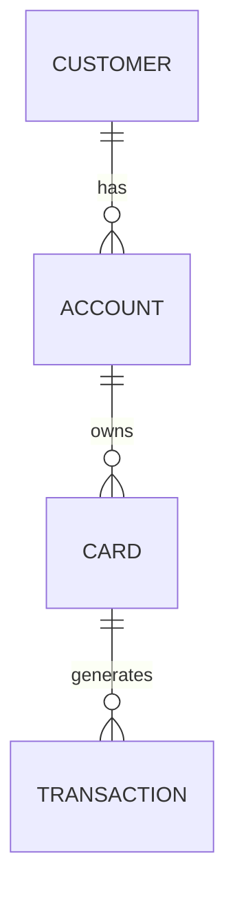

# Phase 4: COPYBOOK → JPA Entity Analysis

## Objective

Parse every COPYBOOK file. Extract field definitions, data types, REDEFINES, OCCURS, COMP-3, and 88-level conditions. Generate comprehensive Entity specification.

## Input

- All COPYBOOK files (.cpy)
- Phase 2 VSAM analysis (for file-to-entity mapping context)

## Deliverables

### 4.1 `04-copybook-analysis/copybook-data-structures.md`

Complete template for the main deliverable:

```markdown
# COPYBOOK Data Structures

## Project Summary

- **Total COPYBOOKs Analyzed:** [N]
- **Total Fields Extracted:** [N]
- **Total Enums Generated:** [N]
- **COPY REPLACING Occurrences:** [N]

## COPYBOOK Inventory

| # | COPYBOOK | Description | Fields | REDEFINES | OCCURS | 88-Level | Used By Programs |
|---|----------|-------------|--------|-----------|--------|----------|-----------------|
| 1 | [name.cpy] | [description] | [N] | [Y/N] | [Y/N] | [N] | [program list] |
| 2 | [name.cpy] | [description] | [N] | [Y/N] | [Y/N] | [N] | [program list] |

---

## Per-COPYBOOK Analysis

### [COPYBOOK-id]

**Source:** `[filepath]`, lines [start]-[end]
**Purpose:** [business description from header comments or inferred]
**Referenced By:** [list of programs using this COPYBOOK]

#### Tree Structure

```
[COPYBOOK-01-LEVEL-NAME] (PIC=X(N), Total Record Length=[N])
├── 05 [field-name]       PIC [pic]  [usage]     → Java: [Type]
│   ├── 88 [CONST-1]      VALUE '[X]'
│   └── 88 [CONST-2]      VALUE '[Y]'
├── 05 [group-field]
│   ├── 10 [sub-field-1]  PIC [pic]              → Java: [Type]
│   └── 10 [sub-field-2]  PIC [pic]              → Java: [Type]
├── 05 [occurs-field]     PIC [pic]  OCCURS [N]  → Java: List<[Type]>
├── 05 [filler]           PIC X(N)               → (FILLER — skip, offset [N])
└── 05 [redef-field]      REDEFINES [field]      → Java: [strategy]
```

#### Field-Level Mapping Table

| Level | Field | PIC | Usage | OCCURS | 88 Values | Java Type | JPA Column | Notes |
|-------|-------|-----|-------|--------|-----------|-----------|------------|-------|
| 05 | [name] | [pic] | [usage] | [N] | [enums] | [type] | [annotation] | [note] |
| 05 | [group] | GROUP | - | - | - | - | @Embedded | Group header |
| 10 | [child] | [pic] | [usage] | - | - | [type] | [annotation] | [note] |

#### Enum Extraction

```java
// Source: [COPYBOOK.cpy], lines [N]-[M]
// Original COBOL:
//     05 [field] PIC X(01).
//       88 [CONST-1] VALUE '[val1]'.
//       88 [CONST-2] VALUE '[val2]'.

@Getter
public enum [EnumName] {
    [CONST_1]("[val1]"),
    [CONST_2]("[val2]");

    private final String code;

    [EnumName](String code) { this.code = code; }

    public static [EnumName] fromCode(String code) {
        for ([EnumName] v : values()) {
            if (v.code.equals(code)) return v;
        }
        throw new IllegalArgumentException("Unknown [EnumName] code: " + code);
    }
}
```

#### COMP-3 Field Inventory (if applicable)

| Field | PIC | Digits | Storage Bytes | Java Type | Unpack Method |
|-------|-----|--------|--------------|-----------|---------------|
| [name] | S9(N)V99 COMP-3 | [N+2] | [(N+2+1)/2] | BigDecimal | `Comp3Converter.unpack(bytes, [scale])` |

#### REDEFINES Strategy (if applicable)

| Original Field | REDEFINES Target | Discriminator | Java Strategy |
|---------------|-----------------|---------------|---------------|
| [field] | [target] | [discriminator field] | @Inheritance or separate DTOs |

#### OCCURS Handling (if applicable)

| Field | OCCURS Count | DEPENDING ON | Java Type | JPA Strategy |
|-------|-------------|--------------|-----------|--------------|
| [name] | [N] | [yes/no] | `List<[Type]>` | @ElementCollection or @OneToMany |

---

(REPEAT above section for EACH COPYBOOK)

## Entity Structure Summary

### Entity: [EntityName] ← [COPYBOOK Name]

**VSAM File:** [filename], key: [field], RECLN=[N]

| Java Field | Type | COBOL Source (level:field:line) | JPA Column | Constraints |
|-----------|------|--------------------------------|------------|-------------|
| [name] | [type] | [05:FIELD:123] | `@Column(name="col", length=N)` | [nullable, unique] |

## COPY REPLACING Registry

| Program | COPYBOOK | Original | Replaced By | Type | PIC Change |
|---------|----------|----------|-------------|------|-----------|
| [pgm].cbl | [cb].cpy | ACCT-ID | CUST-ID | FIELD | X(10)→X(12) |
| [pgm].cbl | [cb].cpy | ==WS-== | ==DB-== | PREFIX | — |
```

### 4.2 `04-copybook-analysis/entity-relationships.md`

Document entity relationships derived from COPYBOOK cross-references:

```markdown
# Entity Relationships

## Relationship Matrix

| Parent Entity | Child Entity | Relationship | FK Field | Source |
|--------------|-------------|-------------|----------|--------|
| Customer | Account | @OneToMany | customer_id | [copybook]:[line] |
| Account | Card | @OneToMany | account_id | [copybook]:[line] |
| Card | Transaction | @OneToMany | card_number | [copybook]:[line] |

## Relationship Diagram


```

## Execution Steps

### Step 1: Parse COPYBOOK Structure

For each COPYBOOK file:
1. Parse 01-level record structures
2. Analyze level numbers: 01=root, 05-49=child groups, 66=rename, 77=elementary, 88=condition
3. Extract PIC clause for each field
4. Note USAGE: COMP/COMP-3/COMP-5/DISPLAY/INDEX/POINTER
5. Detect REDEFINES with type discriminator
6. Detect OCCURS (fixed + DEPENDING ON)
7. Detect VALUE clause for 88 conditions
8. Note SIGN clause: LEADING/TRAILING SEPARATE

### Step 2: Map PIC to Java Types

Apply mapping from `references/cobol-to-java-mappings.md`:

| COBOL PIC Pattern | Java Type | JPA Column | Notes |
|-------------------|-----------|------------|-------|
| 9(N) where N ≤ 9 | Integer | `INTEGER` | Direct parse |
| 9(N) where N > 9 | Long | `BIGINT` | Direct parse |
| 9(N) leading zeros | String | `VARCHAR(N)` | Preserve leading zeros |
| S9(N)V99 (currency) | BigDecimal | `DECIMAL(N+2,2)` | NEVER use double/float |
| S9(N)V9(M) (high precision) | BigDecimal | `DECIMAL(N+M,M)` | Explicit scale |
| X(N) YYYYMMDD date | LocalDate | `DATE` | `DateTimeFormatter.ofPattern("yyyyMMdd")` |
| X(N) timestamp | LocalDateTime | `TIMESTAMP` | Custom formatter |
| X(N) general text | String | `VARCHAR(N)` | trim() trailing spaces |
| X(01) Y/N flag | String | `VARCHAR(1)` | Map Y→true, N→false |

### Step 3: Handle OCCURS Patterns

| COBOL Pattern | Java | JPA |
|---------------|------|-----|
| `OCCURS 5 TIMES` | `List<Detail>` with pre-allocation | `@ElementCollection` or `@OneToMany(cascade=ALL)` |
| `OCCURS DEPENDING ON COUNT` | `List<Item>` with size validation | `@OneToMany(cascade=ALL, orphanRemoval=true)` |
| Nested OCCURS | `List<Group>` each with `List<Item>` | `@ElementCollection` on nested class |

### Step 4: Handle REDEFINES with Discriminator

REDEFINES patterns:
1. **Type Discriminator:** Field X PIC X(1) discriminates structure → `@Inheritance(strategy=SINGLE_TABLE)` + `@DiscriminatorColumn(name="type", discriminatorType=STRING)`
2. **Alternate views:** Same data viewed differently → Create separate DTO classes, choose based on context flag
3. **Variable lengths:** Use nullable fields in single Entity with `@Column(length=maxLength)`

### Step 5: Extract Enums from 88-Level

**Rule:** Every contiguous 88-level block under the same field → One Java enum.

| COBOL | Java |
|-------|------|
| `05 STATUS PIC X(1). 88 STATUS-ACTIVE VALUE 'A'. 88 STATUS-INACTIVE VALUE 'I'. | `enum Status { ACTIVE("A"), INACTIVE("I") }` |

### Step 6: Identify Entity Relationships

For COPYBOOKs referenced by multiple VSAM files:
- VSAM file 1 references COPYBOOK A → Entity A
- VSAM file 2 references COPYBOOK A → Entity A (same entity)
- Foreign keys (cross-file references): @ManyToOne, @OneToMany

### Step 7: Handle COPY REPLACING Statements

`COPY COPYBOOK-NAME REPLACING` is a compile-time text substitution. It changes the effective field names/data types before the COPYBOOK content is included in the program.

**Detection Pattern (in .cbl files):**

| COBOL Pattern | Example |
|---------------|---------|
| `COPY CBNAME REPLACING A BY B` | `COPY ACCREC REPLACING ACCT-ID BY CUST-ID` |
| `COPY CBNAME REPLACING ==PRFX== BY ==NEW==` | `COPY ACCREC REPLACING ==WS-== BY ==DB-==` |
| `COPY CBNAME REPLACING LEADING ==X== BY ==Y==` | Prefix replacement |

**Impact on Entity Mapping:**

| REPLACING Scenario | Rule | Java Entity Handling |
|-------------------|------|---------------------|
| Field name substituted | Map substituted name, not original | `// Source: [COPYBOOK], field [original] REPLACED BY [new] in [program]` |
| Same COPYBOOK, different REPLACING across programs | **One COPYBOOK = One Entity**, document all program-specific variants | Create a "Field Alias Table" in the analysis output |
| REPLACING changes PIC length (e.g., `==X(10)== BY ==X(20)==`) | Entity uses the **maximum** length from all programs | `@Column(name="field", length=20)` with source note |

**Analysis Output Requirement:**
For every COPY statement with REPLACING found, append a REPLACING trace table:

```markdown
## COPY REPLACING Registry

| Program | COPYBOOK | Original | Replaced By | Type | PIC Change |
|---------|----------|----------|-------------|------|-----------|
| [pgm].cbl | [cb].cpy | ACCT-ID | CUST-ID | FIELD | X(10)→X(12) |
| [pgm].cbl | [cb].cpy | WS-ACCT-STATUS | DB-ACCT-STATUS | PREFIX | — |
```

### Step 8: Export COPYBOOK Analysis

Write `04-copybook-analysis/copybook-data-structures.md` containing:
1. COPYBOOK inventory with usage counts
2. Full field-level analysis per COPYBOOK (tree structure + mapping table)
3. Entity structure summary (Entity ← COPYBOOK)
4. JAVA ENUM definitions (from 88-level)
5. COMP-3 field inventory (if any)
6. REDEFINES strategy documentation (if any)
7. OCCURS handling documentation (if any)
8. COPY REPLACING registry (if any)
9. Entity relationship diagram

## Mandatory Coverage Rules

- **100%:** Every 01/05/elementary field must appear (FILLER = documented but not mapped)
- **88-level:** Document as Java enum with values
- **COMP-3:** Note byte count formula: `(digits+1)/2`
- **REPLACING:** Every COPY REPLACING statement must be traced; all substituted names recorded in registry; PIC length changes use maximum across all programs

## Quality Gate (Human Review CP-1)

Before proceeding to Phase 5:
- [ ] Every COPYBOOK fully parsed — count matches Phase 1 inventory
- [ ] ALL fields mapped (100% coverage — FILLER noted but skipped)
- [ ] All REDEFINES patterns identified with Java strategy
- [ ] All OCCURS patterns mapped to Java Lists with JPA strategy
- [ ] All 88-level conditions extracted as Java enums with `fromCode()` method
- [ ] All COMP/COMP-3 fields noted with byte count and unpack method
- [ ] All COPY REPLACING statements traced and registered
- [ ] Entity relationships documented with @ManyToOne/@OneToMany
- [ ] Tree structure present for EACH COPYBOOK
- [ ] DBA review invited at this checkpoint
- [ ] Save `_state-snapshot.json` with `{'phase':4,'status':'pending-review'}`
