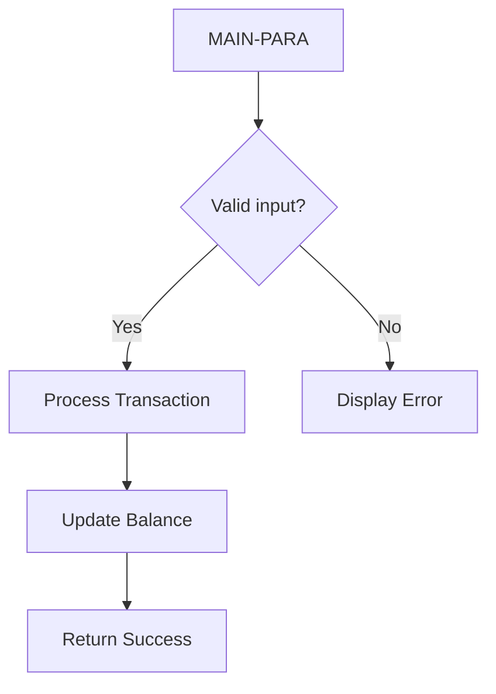

# Phase 5: COBOL Program Logic → Java Service Analysis

## Objective

Analyze every COBOL program's PROCEDURE DIVISION, extract business logic, validation rules, formulas, and control flow. Map to Java Service methods.

## Input

- All COBOL programs (.cbl) — PROCEDURE DIVISION content
- COPYBOOK definitions (from Phase 4) — for field context

## Deliverables

### `05-program-logic/program-logic-analysis.md`

```markdown
# Program Logic Analysis

## Program Inventory

| # | Program | Type | LOC | COPYBOOKs | Sections | Complexity |
|---|---------|------|-----|-----------|----------|-----------|
| 1 | [name] | [type] | [N] | [N] | [N] | High/Med/Low |

## Per-Program Analysis (expanded for each program)

### Program: [NAME]
- **Source:** [filepath], lines [N]-[M]
- **Program Type:** [Batch / CICS Online / DB2 / IMS / Utility]
- **Purpose:** [1-2 sentences derived from program logic, NOT placeholder]

**Control Flow:**


**Paragraph → Service Method:**
| COBOL Paragraph | Function | Java Method | Complexity |
|-----------------|----------|------------|-----------|
| MAIN-PARA | Entry point | `public Response handle(...)` | - |
| [para-1] | [description] | `[method-1]` | [L/M/H] |
| [para-2] | [description] | `[method-2]` | [L/M/H] |

**Business Rules Extracted:**
| # | Rule | Source Paragraph | Source Line | Java Implementation |
|---|------|-----------------|-------------|-------------------|
| 1 | [rule] | [para] | [line] | [Java fragment] |

**Computation Formulas:**
| COBOL Compute | Formula | Source Line | Accuracy |
|--------------|---------|------------|----------|
| COMPUTE A = B + C | `a = b.add(c)` | [N] | Exact BigDecimal |

**Validation Rules:**
| COBOL IF | Validation | Line | Bean Validation |
|----------|-----------|------|----------------|
| IF AMOUNT <= 0 | Amount must be > 0 | [N] | @DecimalMin("0.01") |
| IF DATE NOT NUMERIC | Date format | [N] | @Pattern |

**Error Handling:**
| COBOL Error | Condition (Line) | Java Exception | HTTP |
|-------------|-----------------|----------------|------|
| DUPKEY ON WRITE | [N] | DataIntegrityViolationException | 409 |
| NOTFND ON READ | [N] | NotFoundException | 404 |

**Transaction Boundaries:**
| SYNCPOINT | Context | Line | @Transactional |
|-----------|---------|------|--------------|
```

## Execution Steps

### Step 1: Decompose PROCEDURE DIVISION

For each COBOL program:
1. Identify entry paragraph (first paragraph after PROCEDURE DIVISION)
2. Map paragraph structure (COBOL section → Java module / paragraph → Java method)
3. For CICS programs, map EIBCALEN=0 → GET endpoint (initial screen display)

### Step 2: Extract Control Flow

Build for each program:
1. Entry point identification
2. Branch decisions (IF/EVALUATE → Java switch/if)
3. Loop detection (PERFORM UNTIL → while, PERFORM VARYING → for)
4. GOTO tracking (documented but not preserved)
5. Normal vs. error paths
6. Create Mermaid flowchart for each program (ALL nodes must trace to actual paragraph)

### Step 3: Extract Business Logic

For each compute/arithmetic operation:
1. Translate to BigDecimal calls (see mapping table)
2. Specify precision/scale/rounding explicitly
3. Note COMP-3 source fields and value ranges

### Step 4: Extract Validation Rules

| COBOL Pattern | Java Equivalent |
|---------------|----------------|
| `IF field = SPACES` | `@NotBlank` |
| `IF field NOT NUMERIC` | `@Pattern(regexp="^\\d+$")` |
| `IF field <= ZEROS` | `@DecimalMin("0.01")` |
| `IF field > MAX-VALUE` | `@DecimalMax("9999.99")` |
| `IF date-field < WS-CURRENT-DATE` | `@Past/@PastOrPresent` |

### Step 5: Generate Service Implementation Templates

For each program, generate a Service class skeleton:

```java
@Service
@Transactional
public class [ProgramName]Service {
    // Source: [program.cbl], PROCEDURE DIVISION

    private final [Repository1] [field1];
    private final [Repository2] [field2];

    // Source: MAIN-PARA
    // Source: (PF key handling — one endpoint per PF key if CICS)
    public [ResponseType] handle([RequestType] request) {
        // Translated COBOL logic from [para-name]
    }
}
```

### Step 6: Document Batch Processing Patterns

For batch programs:
- Sequential READ patterns → findAll(Pageable)
- File status checking (10=EOF) → End of stream
- Record counting → .count()
- Control card reading → Configuration @Value annotation

### Step 6a: Handle DFSORT / ICETOOL Pipeline Operations

In mainframe batch systems, DFSORT and ICETOOL (via `SORT` JCL step) are used between COBOL programs to sort, filter, merge, or reformat intermediate datasets. These form **data pipelines** that must be explicitly reconstructed in Java.

**Detection Pattern — Identify in JCL files:**

```
//SYSIN DD *
  SORT FIELDS=(1,10,CH,A)          → Stream.sorted(Comparator)
  INCLUDE COND=(15,1,CH,EQ,C'Y')   → Stream.filter()
  OUTFIL FILES=OUT1,INCLUDE=...    → Partitioned output streams
  SUM FIELDS=(25,5,ZD)             → Collectors.groupingBy + summing
/*
```

**DFSORT → Java Stream / Spring Batch Mapping:**

| DFSORT Operation | JCL Pattern | Java Equivalent |
|-----------------|-------------|----------------|
| SORT FIELDS | `SORT FIELDS=(start,len,order)` | `stream.sorted(Comparator.comparing(...))` or Spring Batch `Sort` |
| INCLUDE COND | `INCLUDE COND=(pos,len,op,val)` | `stream.filter(record -> ...)` or `ClassifierCompositeItemProcessor` |
| OMIT COND | `OMIT COND=(pos,len,op,val)` | `stream.filter(record -> !...)` |
| SUM FIELDS | `SUM FIELDS=(pos,len,type)` | `Collectors.groupingBy(key, Collectors.summingDouble(...))` |
| OUTFIL FILES | `OUTFIL FILES=DD1,INCLUDE=...` | Partition to separate output files → separate `FlatFileItemWriter` |
| JOINKEYS | `JOINKEYS FILES=F1,FIELDS=(...)` | `stream.collect()` + Map join / Spring Batch `ItemProcessor` with lookup |
| REFORMAT FIELDS | `REFORMAT FIELDS=(f1:pos,len,...)` | Map to output DTO in `ItemProcessor` |
| MERGE FILES | `MERGE FIELDS=(pos,len,order)` | `Stream.concat(s1, s2).sorted(...)` |

**ICETOOL → Java Mapping:**

| ICETOOL Operator | Function | Java Equivalent |
|-----------------|----------|----------------|
| COPY | Copy dataset | `FileCopyUtils` / pass-through `ItemProcessor` |
| COUNT | Count records | `stream.count()` / `StepExecutionListener.afterStep` row count |
| DISPLAY | Display records | `log.info()` / `SysOutItemWriter` |
| DUPERASE | Remove duplicates | `stream.distinct()` |
| OCCUR | Frequency count | `Collectors.groupingBy(Function.identity(), Collectors.counting())` |
| RANGE | Select range of records | `stream.skip(N).limit(M)` |
| SELECT | Select records | `stream.filter()` |
| SORT | Sort records | `stream.sorted()` |
| SPLICE | Join/combine datasets | Join via Map or DB temporary table |
| UNIQUE | Unique records | `stream.distinct()` |
| VERIFY | Verify dataset | `@PostConstruct` validation step / `JobExecutionDecider` |

**Pipeline Reconstruction Rule:**
When a JCL file contains a SORT step between two COBOL program steps, document the data transformation as an explicit pipeline stage:

```markdown
## Data Pipeline: [Pipeline Name]

PROGRAM-A (extract)
    → DFSORT/SORT step (filter + sort + reformat)
        → PROGRAM-B (process)
            → DFSORT/SUM step (aggregate)
                → PROGRAM-C (report)
```

In Java, this maps to:
```java
// Spring Batch job: [PipelineName]Job
@Bean
public Step extractStep() { return stepBuilderFactory.get("extract")... }
@Bean
public Step transformStep() { return stepBuilderFactory.get("transform")
    .<InputRecord, OutputRecord>chunk(100)
    .reader(flatFileItemReader())
    .processor(compositeProcessor()) // Includes filter + reformat logic
    .writer(flatFileItemWriter())
    .build(); }
@Bean
public Step aggregateStep() { return stepBuilderFactory.get("aggregate")... }
@Bean
public Step reportStep() { return stepBuilderFactory.get("report")... }

@Bean
public Job pipelineJob() {
    return jobBuilderFactory.get("pipelineJob")
        .start(extractStep())
        .next(transformStep())
        .next(aggregateStep())
        .next(reportStep())
        .build();
}
```

### Step 7: Export Program Logic Analysis

Write `05-program-logic/program-logic-analysis.md`

## Quality Gate (Human Review CP-2)

- [ ] All paragraphs mapped to Java methods
- [ ] All COMPUTE formulas translated with BigDecimal
- [ ] All IF validations have Bean Validation equivalents
- [ ] Control flow Mermaid diagrams verified rendering
- [ ] Business analyst + COBOL developer invited to review CP-2
- [ ] Save `_state-snapshot.json` with {'phase':5,'status':'pending-review'}
