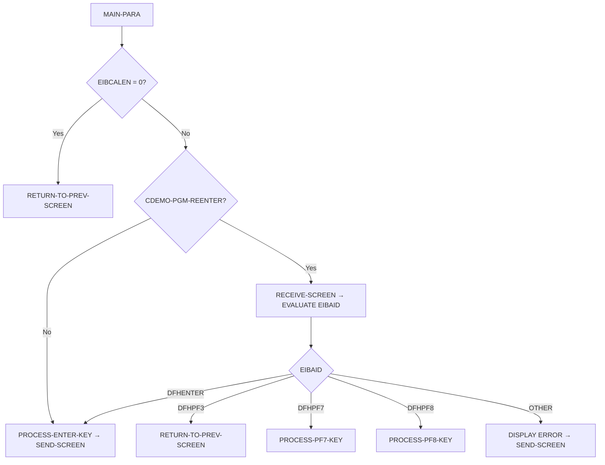

# Phase 5: COBOL Program Logic → Java Service Analysis

## Objective

Analyze EVERY COBOL program's PROCEDURE DIVISION. Extract business logic, validation rules, formulas, control flow, and data access patterns. Map to Java Service methods with code-level precision. **Every .cbl file must be analyzed — no program may be skipped.**

## Input

- All COBOL programs (.cbl) — complete PROCEDURE DIVISION content
- COPYBOOK definitions (from Phase 4) — for field context
- BMS maps (from Phase 3) — for screen I/O context

## Deliverable Precision Standard

**For EACH COBOL program, the analysis MUST contain ALL of the following sections.**
If any section is missing for any program, the deliverable is INCOMPLETE.

| Section | What It Must Contain |
|---------|---------------------|
| Program Header | Name, type, LOC, COPYBOOKs used, files accessed |
| Paragraph Inventory | Every paragraph with line number and 1-sentence purpose |
| Branch Map | ALL IF/ELSE/EVALUATE with conditions, source lines, and true/false branches |
| File I/O Operations | ALL READ/WRITE/REWRITE/STARTBR/READNEXT/READPREV/ENDBR with file, key, RESP handling |
| Screen I/O (CICS) | ALL SEND/RECEIVE MAP with field-level mapping and ERASE/NO ERASE |
| Validation Rules | ALL input-rejecting IF checks with error messages, field names, and source lines |
| Computation Formulas | ALL COMPUTE/ADD/SUBTRACT/MULTIPLY/DIVIDE with exact Java BigDecimal translation |
| State Machine | If program has multi-state logic (edit cycles), full state table with triggers and transitions |
| Variable Usage | All working-storage variables that hold business data (not just technical variables like WS-RESP-CD) |
| CommArea Analysis | If program uses commarea: every field read/written, its purpose, and the program it comes from/goes to |
| Error Handling | ALL RESP code evaluations with conditions and Java exception mapping |
| Java Service Method Map | Paragraph → method signature with full parameter types and return type |

## Deliverables

### `05-program-logic/program-logic-analysis.md`

For projects with ≤15 programs: single file.
For projects with >15 programs: split into `program-logic-analysis-part1.md`, `part2.md`, etc. (one part per logical module or 5-8 programs).

```markdown
# Program Logic Analysis

## Program Inventory

| # | Program | Type | LOC | COPYBOOKs | Files Accessed | Complexity | Analyzed? |
|---|---------|------|-----|-----------|---------------|-----------|-----------|
| 1 | COSGN00C | CICS Online | 260 | 6 | USRSEC | Medium | ✅ |
| 2 | COTRN00C | CICS Online | 700 | 6 | TRANSACT | High | ✅ |

**Total programs: [N]. All analyzed: YES/NO**

---

## Per-Program Analysis (REPEAT for EVERY program)

### Program: [PROGRAM-NAME]

**Source:** `[filepath].cbl`, lines 1-[M]
**Program Type:** [Batch / CICS Online / DB2 / IMS / Utility]
**Application Module:** [carddemo / auth / transaction / batch / etc.]
**Purpose:** [1-2 sentences — derived from program header comments and actual logic]

#### Control Flow Diagram



**Every node MUST trace to an actual paragraph name in the source code.**

#### Paragraph Inventory

| # | Paragraph Name | Source Line | Purpose | Java Method | Complexity |
|---|---------------|------------|---------|------------|-----------|
| 1 | MAIN-PARA | [line] | Entry point, dispatch by EIBCALEN/PF key | `handle()` | - |
| 2 | PROCESS-ENTER-KEY | [line] | Validate input, process selection | `processEnterKey()` | M |
| 3 | [para-name] | [line] | [description from actual code] | `[methodName]()` | L/M/H |

#### Branch Map (ALL IF/EVALUATE)

| # | Source Line | Condition | TRUE Branch | FALSE Branch | Java Equivalent |
|---|------------|-----------|------------|-------------|----------------|
| 1 | [line] | `EIBCALEN = 0` | RETURN-TO-PREV-SCREEN | Check CDEMO-PGM-REENTER | `if (eibcalen == 0)` |
| 2 | [line] | `USERIDI = SPACES` | Set error flag, display msg | Continue to password check | `if (userId.isBlank())` |
| 3 | [line] | `EVALUATE EIBAID` | WHEN DFHENTER/DFHPF3/... | WHEN OTHER | `switch(eibaid)` |

#### File I/O Operations

| # | Operation | File | Key Field | Source Line | RESP Handling | Java Equivalent |
|---|-----------|------|----------|------------|--------------|----------------|
| 1 | READ | USRSEC | SEC-USR-ID | [line] | 0=OK, 13=NOTFND → error msg | `repo.findById().orElseThrow()` |
| 2 | READ UPDATE | CARDDAT | CARD-NUM | [line] | 0=OK, 12=DUPKEY, 13=NOTFND | `repo.findByIdForUpdate()` |
| 3 | STARTBR | TRANSACT | TRAN-ID | [line] | 0=OK, 13=NOTFND=EOF | `em.createEntityGraph()` |
| 4 | READNEXT | TRANSACT | TRAN-ID | [line] | 0=OK, 8=ENDFILE=EOF | `cursor.next()` |
| 5 | READPREV | TRANSACT | TRAN-ID | [line] | 0=OK, 8=ENDFILE=EOF | `cursor.prev()` |
| 6 | REWRITE | CARDDAT | CARD-NUM | [line] | 0=OK, SYNCPOINT | `repo.save()` + @Transactional |
| 7 | WRITE | TRANSACT | TRAN-ID | [line] | 0=OK, 12=DUPKEY | `repo.save()` |

#### Screen I/O Operations (CICS only)

| # | Operation | Map | Source Line | Fields Affected | ERASE? | Java Equivalent |
|---|-----------|-----|------------|----------------|--------|----------------|
| 1 | SEND MAP | COSGN00A | [line] | ERRMSGO, TITLE01O, etc. | YES | `ResponseEntity.ok()` |
| 2 | RECEIVE MAP | COSGN00A | [line] | USERIDI, PASSWDI | N/A | `@RequestBody LoginRequest` |

#### Validation Rules (ALL input-rejecting checks)

| # | Source Line | COBOL IF Condition | Field | Error Message | Java Validation | HTTP Status |
|---|------------|-------------------|-------|--------------|----------------|------------|
| 1 | [line] | `USERIDI = SPACES` | userId | "Please enter User ID..." | `@NotBlank` | 400 |
| 2 | [line] | `PASSWDI = SPACES` | password | "Please enter Password..." | `@NotBlank` | 400 |
| 3 | [line] | `CARD-NAME NOT ALPHABETIC` | embossedName | "Card name can only contain..." | `@Pattern` | 400 |

#### Computation Formulas (ALL arithmetic)

| # | Source Line | COBOL COMPUTE/Operation | Formula | Java Translation | Precision |
|---|------------|------------------------|---------|-----------------|----------|
| 1 | [line] | `COMPUTE WS-IDX = WS-IDX + 1` | `idx = idx + 1` | `idx++` | Integer |
| 2 | [line] | `COMPUTE BAL = CREDIT - DEBIT` | `bal = credit - debit` | `credit.subtract(debit)` | BigDecimal |

#### State Machine (ONLY for programs with multi-state edit cycles)

| State Name | Entry Condition | Trigger | Action | Next State | Source Line |
|-----------|----------------|---------|--------|-----------|------------|
| DETAILS-NOT-FETCHED | EIBCALEN=0, first entry | ENTER (with valid ID) | READ from VSAM, populate fields | SHOW-DETAILS | [line] |
| SHOW-DETAILS | Data loaded, display | F5 (save) | Validate → READ UPDATE → REWRITE | CHANGES-OKAYED-AND-DONE | [line] |
| SHOW-DETAILS | Data loaded, display | F12 (cancel) | Discard changes, return | DETAILS-NOT-FETCHED | [line] |
| CHANGES-OKAYED-AND-DONE | REWRITE succeeded | F3 (exit) | SEND success msg, return | DETAILS-NOT-FETCHED | [line] |
| CHANGES-OKAYED-LOCK-ERROR | READ UPDATE failed (12/106) | — | Show lock error | SHOW-DETAILS | [line] |

#### Working-Storage Variable Usage

| Variable | PIC | Purpose | Modified By Paragraphs | Java Equivalent |
|----------|-----|---------|----------------------|----------------|
| WS-ERR-FLG | X(01) | Error flag (Y/N) | PROCESS-ENTER-KEY, VALIDATE-* | `boolean hasError` |
| WS-MESSAGE | X(80) | Error/success message | All paragraphs that display to screen | `String message` |
| WS-TRANSACT-EOF | X(01) | EOF flag for browsing | READNEXT, READPREV | `boolean hasNext` |
| WS-TRAN-AMT | +99999999.99 | Formatted transaction amount | POPULATE-TRAN-DATA | `String formattedAmount` |

#### CommArea Analysis (if program uses DFHCOMMAREA)

**Fields READ from CommArea (input from calling program):**
| CommArea Field | Source Program | Purpose | Source Line |
|---------------|---------------|---------|------------|
| CDEMO-USER-ID | COSGN00C | User context | [line] |
| CDEMO-PGM-CONTEXT | All | First entry (0) vs re-entry (1) | [line] |

**Fields WRITTEN to CommArea (output to called program via XCTL):**
| CommArea Field | Target Program | Purpose | Source Line |
|---------------|---------------|---------|------------|
| CDEMO-TO-PROGRAM | COADM01C | XCTL destination | [line] |
| CDEMO-USER-TYPE | COMEN01C | Role for access control | [line] |

#### Error Handling Map

| RESP Code | Condition | Source Line | Action | Java Exception |
|-----------|----------|------------|--------|---------------|
| DFHRESP(NORMAL)=0 | Operation succeeded | [line] | Continue | — |
| DFHRESP(NOTFND)=13 | Record not found | [line] | Set EOF, show msg | `NotFoundException` → 404 |
| DFHRESP(DUPKEY)=12 | Duplicate key on WRITE | [line] | Show error | `DataIntegrityViolationException` → 409 |
| DFHRESP(ENDFILE)=8 | End of browse | [line] | Set EOF flag | End of stream |
| DFHRESP(NOSTG)=106 | No storage (lock conflict) | [line] | Show lock error | `PessimisticLockException` → 409 |

#### Java Service Method Signatures

```java
// Source: [program.cbl], PROCEDURE DIVISION
@Service
@RequiredArgsConstructor
public class [ProgramName]Service {

    private final [Entity1]Repository [repo1];
    private final [Entity2]Repository [repo2];

    // Source: MAIN-PARA, line [N]
    // EIBCALEN=0 → initial display; ENTER → process; PF3 → return; PF7/PF8 → pagination
    public [ResponseType] handle([RequestType] request, [ContextType] context) {
        // ...
    }

    // Source: PROCESS-ENTER-KEY, line [N]
    // Validates input, processes selection, triggers XCTL
    private [ReturnType] processEnterKey([ParamType] param) {
        // ...
    }

    // Source: PROCESS-PAGE-FORWARD, line [N]
    // STARTBR → READNEXT × pageSize → ENDBR
    private [ReturnType] processPageForward([ParamType] param) {
        // ...
    }

    // Source: [paragraph-name], line [N]
    // [1-sentence purpose]
    [accessModifier] [ReturnType] [methodName]([ParamType] params) {
        // ...
    }
}
```

---

(Repeat above section for EVERY COBOL program)
```

### `05-program-logic/batch-processing-patterns.md` (NEW)

For EACH batch program, document the Spring Batch equivalent:

```markdown
## Batch Program: [PROGRAM-NAME]

**Source:** `[program].cbl`
**JCL Job(s):** `[jobname].jcl`

### COBOL File Processing Pattern

| COBOL Pattern | Source Lines | Spring Batch Equivalent |
|--------------|-------------|----------------------|
| Sequential READ of DALYTRAN | [lines] | `FlatFileItemReader<DailyTransaction>` |
| Random READ of CARDXREF by key | [lines] | `CardXrefRepository.findById()` in processor |
| WRITE to TRANSACT | [lines] | `JdbcBatchItemWriter<Transaction>` |
| File status = 10 (EOF) | [lines] | `ItemReader.read()` returns null |
| Control card read | [lines] | `@Value("${batch.control.*}")` |
| ACCEPT CURRENT-DATE | [lines] | `LocalDate.now()` |

### Chunk Configuration

```java
// Source: [program.cbl] PROCEDURE DIVISION logic
@Bean
public Step [stepName]Step() {
    return stepBuilderFactory.get("[stepName]")
        .<InputRecord, OutputRecord>chunk(100)  // batch-size from JCL or default
        .reader([readerBean]())
        .processor([processorBean]())
        .writer([writerBean]())
        .faultTolerant()
        .skipPolicy([skipPolicy]())  // Skip invalid records, log to reject file
        .skipLimit(1000)             // From JCL control card or default
        .build();
}
```

### Skip Logic

| COBOL Condition | Source Line | Spring Batch SkipPolicy |
|----------------|------------|----------------------|
| CARDXREF NOT FOUND → skip | [line] | Skip and log warning |
| ACCTDATA NOT FOUND → skip | [line] | Skip and log "ACCOUNT NOT FOUND" |
| Invalid record format → skip | [line] | SkipParseException |

### Job Flow

```java
// Source: [jobname].jcl step sequence
@Bean
public Job [jobName]Job() {
    return jobBuilderFactory.get("[jobName]")
        .start([step1]())
        .next([step2]())
        .next([step3]())
        .build();
}
```

---

(Repeat for EVERY batch program)
```

## Execution Steps

### Step 1: Inventory ALL Programs

1. List every .cbl file from Phase 1
2. For each: count lines (estimate LOC), identify type (CICS/Batch/Utility)
3. List COPYBOOK references (COPY statements)
4. List file references (SELECT/ASSIGN, EXEC CICS READ/WRITE, EXEC SQL, EXEC DLI)

### Step 2: Analyze EACH Program (one at a time — NEVER batch)

For each program:
1. Read the complete PROCEDURE DIVISION
2. Build paragraph inventory with line numbers
3. Map control flow (EIBCALEN check → ENTER/PF key dispatch)
4. Extract ALL file I/O operations with RESP handling
5. Extract ALL validation IF checks with error messages
6. Extract ALL COMPUTE/arithmetic operations
7. Identify state machine (if multi-state edit cycle)
8. Map CommArea fields (input/output)
9. Generate Java service method signatures

**Write analysis immediately after completing each program. Do NOT hold all in memory.**

### Step 3: Cross-Validate

After all programs analyzed:
1. Verify paragraph count matches actual source (grep paragraph names)
2. Verify every VSAM file access from Phase 2 appears in at least one program's File I/O section
3. Verify every BMS map from Phase 3 appears in at least one program's Screen I/O section

### Step 4: Export

Write `05-program-logic/program-logic-analysis.md`
Write `05-program-logic/batch-processing-patterns.md`
Update `_state-snapshot.json` with `{'phase': 5, 'status': 'complete', 'programs_analyzed': N}`

## Quality Gate (Human Review CP-2)

- [ ] ALL .cbl programs analyzed — count matches Phase 1 inventory
- [ ] Every paragraph mapped to a Java method
- [ ] Every IF/EVALUATE branch documented with source line
- [ ] Every file I/O operation documented with RESP handling
- [ ] Every validation rule has Java Bean Validation equivalent
- [ ] Every COMPUTE formula translated with BigDecimal
- [ ] State machines documented for ALL multi-state programs
- [ ] CommArea data flow documented for ALL CICS programs
- [ ] Control flow Mermaid diagrams verified rendering
- [ ] Batch processing patterns mapped to Spring Batch for ALL batch programs
- [ ] Business analyst + COBOL developer invited to review CP-2
- [ ] Save `_state-snapshot.json` with `{'phase':5,'status':'pending-review'}`
