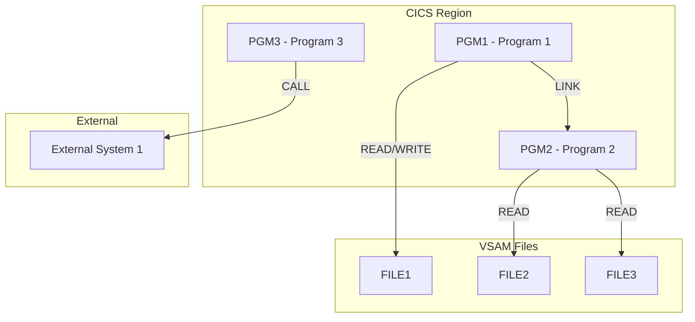
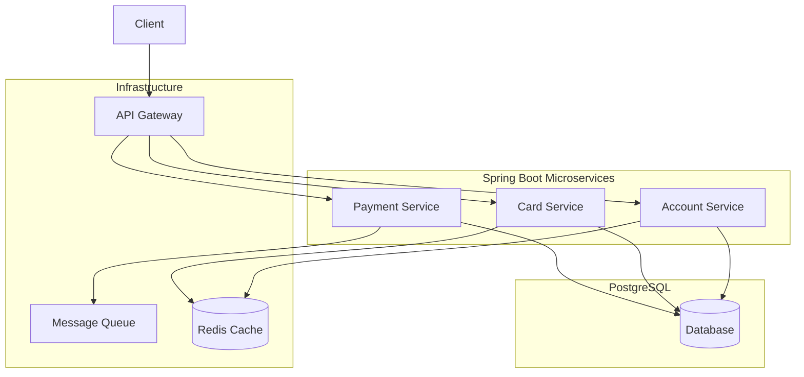
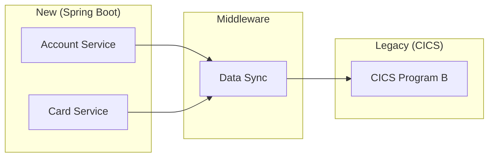
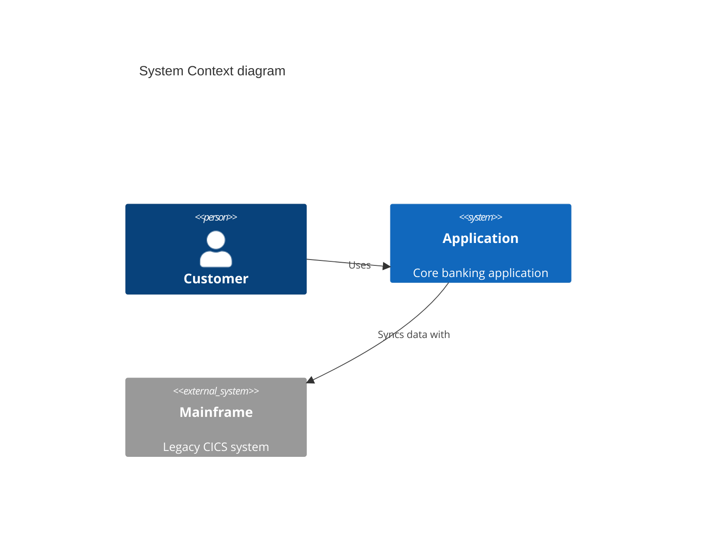

# Phase 6: Architecture Reconstruction + Dependency Graph

## Objective

Reconstruct the as-is architecture from source code analysis. Produce detailed Mermaid diagrams showing program dependencies, data flows, hybrid architecture, and microservice boundary recommendations.

## Input

- Phase 1-5 analysis output
- All COBOL programs, COPYBOOKs, VSAM structures, JCL files

## Deliverables

### `06-architecture/architecture-diagrams.md`

```markdown
# Architecture Reconstruction

## Current State Architecture



## Target State Architecture



## Program Dependency Matrix

| From/To | PGM1 | PGM2 | PGM3 | FILE1 | FILE2 | FILE3 |
|---------|------|------|------|-------|-------|-------|
| PGM1    | -    | LINK | -    | R/W   | -     | -     |
| PGM2    | -    | -    | -    | -     | R     | R     |
| PGM3    | -    | -    | -    | -     | -     | -     |

## Microservice Boundary Recommendations

| Service | Programs | VSAM Files | Description | Dependencies |
|---------|----------|------------|-------------|-------------|
| [Name] | [list] | [list] | [purpose] | [list] |

## Hybrid Architecture (Migration Transit)



## Integration Patterns

| Pattern | From | To | Protocol |
|---------|------|-----|---------|
| [pattern] | [from] | [to] | [protocol] |

## System Context Diagram



## Data Flow Summary

| Flow | Source Program | Data | Destination | Via |
|------|---------------|------|------------|-----|
| [name] | [pgm] | [data] | [dest] | [trans] |
```

## Microservice Decomposition

### Module Dependency Graph (Mermaid)

Required output: Generate a module dependency graph showing ALL inter-module relationships with clear directional edges.

### Rule: Use Forward Engineering

Build the target architecture by asking:
1. **What business capability does this module provide?** → Defines service boundary
2. **What data does it own?** → Defines Entity + Repository
3. **What triggers it?** → Defines API/Event endpoints
4. **What does it depend on?** → Defines integration patterns

## JCL Conversion to Spring Batch

### Summary Table

| JCL Job | Category | Spring Batch Job | Complexity |
|---------|----------|-----------------|-----------|
| [name] | [category] | [BatchConfig] | High/Med/Low |

### JCL DD → ItemReader/ItemWriter

| JCL DD Statement | Dataset | Reader/Writer | Configuration |
|-----------------|---------|--------------|---------------|
| DD DSN=input | [name] | FlatFileItemReader | lines to skip, delimiter |

### COND → Skip/Retry

| JCL Step | COND | Spring Batch Policy |
|-----------|------|-------------------|
| STEP1 | (0,NE) | .next() unconditional |
| STEP2 | (4,LT) | .on("FAILED").to(skipStep) |

### Scheduler Mapping (if scheduler exists)

| # | Scheduler | CA-7/Control-M | Target |
|---|-----------|---------------|--------|
| 1 | [name] | [job] | @Scheduled cron="..." |

## Security Architecture (RACF → Spring Security)

### User/Role Configuration

| Component | Source | Target Spring Security |
|-----------|--------|----------------------|
| Authentication | RACF User ID | JWT + BCrypt |
| Authorization | RACF Profiles | @PreAuthorize("hasRole") |
| Transaction Auth | Resource Class | Method-level @PreAuthorize |

## Execution Steps

### Step 1: Build Dependency Graph

From Phase 1 findings and Phase 5 analysis:
1. Build a complete program-to-program dependency matrix
2. Identify direct CALL/LINK relationships
3. Identify data dependencies (VSAM file sharing)
4. Map to target service boundaries

### Step 2: Draw Current-State Architecture

Generate Mermaid diagram showing:
- All programs as nodes
- All data files as nodes
- All external system integrations
- Directional arrows for dependencies
- Color code: CICS=blue, Batch=green, External=red

### Step 3: Design Target Architecture

Apply forward engineering principles:
1. Group programs by business domain
2. Define service boundaries (single domain ownership)
3. Define integration patterns between services
4. Add infrastructure layer (Gateway, MQ, Cache)

### Step 4: Map JCL to Spring Batch

For each JCL file:
1. Map DD statements to FlatFileItemReader/Writer or JpaItemReader/Writer
2. Translate COND parameters to Batch skip/retry policies
3. Map GDG references to partitioned processing

### Step 5: Map Security

For RACF profiles found:
1. Map User authentication → JWT
2. Map Resource authorization → @PreAuthorize
3. Document the migration of plain-text passwords → BCrypt

### Step 6: Export Architecture Diagrams

Write `06-architecture/architecture-diagrams.md`
Write `06-architecture/scheduler-mapping.md` (if scheduler exists)

## Quality Gate (Human Review CP-3)

- [ ] Every diagram component traceable to COBOL source
- [ ] All Mermaid diagrams verified rendering correctly
- [ ] Service boundaries follow single-ownership principle
- [ ] Solution architect invited to review CP-3
- [ ] Save `_state-snapshot.json` with {'phase':6,'status':'pending-review'}
