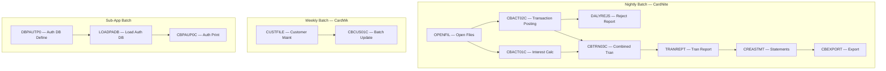

# Phase 8e: Batch Job Dependency Graph

> **DEPENDS ON:** Phase 1 (Source Inventory JCL) + Phase 5 (Batch Programs) + Phase 6 (Architecture)  
> **OUTPUT:** `06-architecture/batch-dependency-graph.md`

## Objective

Reconstruct the complete batch job dependency chain from JCL files, scheduler definitions, and COBOL batch program analysis. Generate a directed acyclic graph (DAG) showing ALL job dependencies, data flows between jobs, and conditional execution paths.

## Why This Phase Is Critical

- Batch job execution order is not always explicit — GDG references, //* COMMENTS, and scheduler dependencies reveal implicit ordering
- Missing a single dependency step can cause data corruption in production
- Spring Batch `Flow` configuration must replicate exact JCL COND/IF-THEN-ELSE logic
- K8s CronJob scheduling must match CA7/Control-M timing exactly

## Dependency Detection Rules

### Rule 1: JCL STEP Sequence = Topological Order

Each JCL file's EXEC statements define a strict execution order within that job:

```
//STEP1 EXEC PGM=CBACT01C   →  step1()
//STEP2 EXEC PGM=CBACT02C   →  step2()
//STEP3 EXEC PGM=CBTRN01C   →  step3()
```

Spring Batch: `jobBuilder.get("job").start(step1()).next(step2()).next(step3())`

### Rule 2: GDG Relative Generation = Cross-Job Dependency

When multiple JCL jobs reference the same GDG:

```
//JOB1: OUTPUT → GDG.TRANFILE(+1)   (creates +1 generation)
//JOB2: INPUT  → GDG.TRANFILE(0)    (reads latest)
```

This implies: **JOB2 depends on JOB1**. Map as `JOB1 → JOB2`.

### Rule 3: DISP=OLD/SHR = Data Dependency

JCL DD statements reveal which files are read-only vs updated:

```
//INPUT  DD DSN=ACCT.DATA,  DISP=SHR   → step reads from previous job
//OUTPUT DD DSN=RPT.DATA,   DISP=NEW   → step creates output for next job
```

### Rule 4: COND Parameters = Conditional Branches

```
//STEP2 EXEC PGM=CBACT02C, COND=(4,LT,STEP1)
```

Means: "Run STEP2 only if STEP1 return code is NOT less than 4."
Spring Batch equivalent: `.on("COMPLETED").to(step2()).from(step1()).on("FAILED").end()`

### Rule 5: CA7/Control-M Schedule = Cron Expression

```
//* CA-7: SCHID=CARDNITE,FREQ=D,START=0200
```

Maps to: `@Scheduled(cron = "0 0 2 * * *")` (2:00 AM daily)

## CardDemo Batch Dependency Graph (Example)



## Dependency Matrix

| Job ID | Job Name | Depends On | Data Input (DSN) | Data Output (DSN) | Schedule | Critical |
|--------|---------|-----------|-----------------|-----------------|----------|----------|
| J01 | OPENFIL | — | — | GDG.TRANFILE(+0) | 02:00 Daily | YES |
| J02 | CBACT01C | J01 | ACCTDATA, TRANTYPE | ACCTDATA (updated) | After J01 | YES |
| J03 | CBACT02C | J01 | DALYTRAN, CARDDATA, CARDXREF, TRANTYPE | TRANSACT, TCATBALF, ACCTDATA | After J01 | YES |
| J04 | DALYREJS | J03 | DALYTRAN (rejects) | DALYREJS (report) | After J03 | NO |
| J05 | CBTRN03C | J02, J03 | TRANSACT, ACCTDATA | TRANSACT (indexed) | After J03 | YES |
| J06 | TRANREPT | J05 | TRANSACT | REPTDATA | After J05 | NO |
| J07 | CREASTMT | J06 | ACCTDATA, TRANSACT | STMTDATA | After J06 | YES |
| J08 | CBEXPORT | J07 | ACCTDATA | EXPORT.FILE | After J07 | NO |
| J09 | CUSTFILE | — | CUSTDATA | CUSTDATA (updated) | 02:00 Sunday | NO |
| J10 | CBCUS01C | J09 | CUSTDATA | CUSTDATA (updated) | After J09 | NO |
| J11 | DBPAUTP0 | — | DBD(PADFLDBD) | IMS DB (auth) | After batch | NO |
| J12 | LOADPADB | J11 | AUTH.DATA | IMS DB (loaded) | After J11 | NO |
| J13 | CBPAUP0C | J12 | IMS DB | AUTH.RPT | After J12 | NO |

## COND/IF-THEN-ELSE Translation

| JCL Condition | Spring Batch Flow |
|--------------|-------------------|
| `COND=(0,NE,STEP1)` — Run if STEP1 RC≠0 | `.from(step1()).on("FAILED").to(correctionStep())` |
| `COND=(4,LT,STEP1)` — Run if STEP1 RC≥4 | `.from(step1()).on("COMPLETED").to(step2())` |
| `IF (STEP1.RC = 0) THEN` | `.from(step1()).on("COMPLETED").to(successStep())` |
| `IF (STEP1.RC >= 8) THEN` | `.from(step1()).on("FAILED").to(errorStep())` |
| `//* ALWAYS RUN` | `.next(alwaysStep())` |

## K8s CronJob Scheduling

| CA7/Control-M Entry | Kubernetes CronJob |
|--------------------|--------------------|
| `CardNite, FREQ=D, START=0200` | `schedule: "0 2 * * *"` |
| `CardWk,  FREQ=W, START=0300, DAY=SUN` | `schedule: "0 3 * * 0"` |
| `AuthLd,  FREQ=M, START=0100, DAY=1` | `schedule: "0 1 1 * *"` |
| `TRANIDX, FREQ=D, START=0600` | `schedule: "0 6 * * *"` |

## Reconstruction Methodology

For each JCL job, extract:

1. **Job Name** — from `//jobname JOB`
2. **Steps** — from `//stepname EXEC PGM=`
3. **DD Statements** — from `//ddname DD DSN=,DISP=`
4. **GDG References** — from `DSN=GDG.BASE(+N)` or `DSN=GDG.BASE(N)`
5. **COND Parameters** — from `COND=(RC,OP,STEP)`
6. **Scheduler Hints** — from `//* CA-7:` or `//* CONTROL-M:` comments
7. **Program Names** — from PGM= parameter

Then cross-reference with Phase 5 batch program analysis to understand what each step does.

## Execution Steps

### Step 1: Parse All JCL Files

Extract: JOB card, EXEC statements, DD statements, COND parameters, scheduler comments.

### Step 2: Build Adjacency Matrix

Create N×N matrix where N = number of batch jobs. For each pair (i, j): if GDG output of i matches GDG input of j → dependency.

### Step 3: Detect Scheduler Timing

Extract FREQ=, START=, DAY= from scheduler comments.

### Step 4: Draw DAG

Generate Mermaid graph showing all jobs, dependencies, and data flows.

### Step 5: Generate Spring Batch Flow Config

Translate each JCL job to Spring Batch configuration with correct flow control.

### Step 6: Export

Write `06-architecture/batch-dependency-graph.md` + update scheduler-mapping.md.

## Quality Gate

- [ ] All JCL jobs appear in dependency DAG
- [ ] All GDG references resolved to cross-job dependencies
- [ ] COND parameters translated to Spring Batch flow control
- [ ] Scheduler timing mapped to CronJob expressions
- [ ] Critical path identified (longest chain from OPENFIL to CBEXPORT)
- [ ] No cycles in dependency graph (verified via topological sort)
