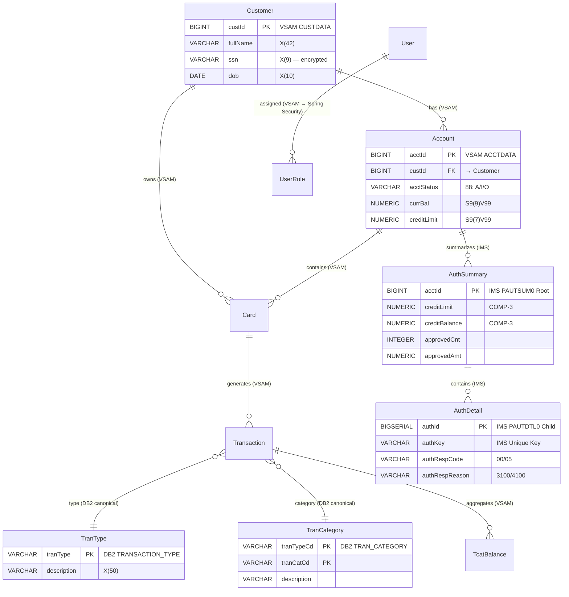

# Phase 8g: IMS/DB2/VSAM Data Model Merge

> **DEPENDS ON:** Phase 2 (VSAM) + Phase 4 (COPYBOOK) + Sub-App IMS/DB2 analysis  
> **OUTPUT:** `04-copybook-analysis/unified-data-model.md`

## Objective

Merge IMS hierarchical, DB2 relational, and VSAM flat-file data models into a single unified relational model suitable for PostgreSQL migration. Resolve overlapping entity definitions, normalize IMS segments into relational tables, and produce the definitive target schema.

## Why This Phase Is Critical

- VSAM, DB2, and IMS each define overlapping entities (e.g., account data exists in all three)
- IMS segments have parent-child relationships that must become SQL foreign keys
- DB2 tables may duplicate VSAM data — deduplication needed
- The unified model is the single source of truth for ALL JPA Entity code

## Data Source Inventory

| Source | Technology | Entities | Key Type | Structure |
|--------|-----------|---------|----------|-----------|
| ACCTDATA VSAM | VSAM KSDS | Account | Single key | Flat record |
| CUSTDATA VSAM | VSAM KSDS | Customer | Single key | Flat record |
| CARDDATA VSAM | VSAM KSDS | Card | Single key | Flat record |
| TRANSACT VSAM | VSAM KSDS | Transaction | Single key | Flat record |
| TRANSACTION_TYPE | DB2 Table | TranType | Single key | Relational |
| TRAN_CATEGORY | DB2 Table | TranCat | Composite key | Relational |
| PAUTSUM0 | IMS Segment (Root) | AuthSummary | Single key | Hierarchical (parent) |
| PAUTDTL0 | IMS Segment (Child) | AuthDetail | Descending key | Hierarchical (child of PAUTSUM0) |

## Merge Strategy

### Step 1: Identify Overlapping Entities

| Domain | VSAM Source | DB2 Source | IMS Source | Resolved Entity | Notes |
|--------|-----------|-----------|-----------|-----------------|-------|
| Account | ACCTDATA (VSAM) | — | PAUTSUM0 (IMS Root) | **accounts** | ACCTDATA is canonical; AuthSummary is derived/aggregated |
| Customer | CUSTDATA (VSAM) | — | — | **customers** | Single source |
| Card | CARDDATA (VSAM) | — | — | **cards** + card_xref | No overlap |
| Transaction | TRANSACT (VSAM) | — | PAUTDTL0 (IMS Child) | **transactions** + **auth_detail** | IMS has different transaction subset |
| TranType | TRANTYPE (VSAM) | TRANSACTION_TYPE (DB2) | — | **tran_types** | **DB2 IS CANONICAL** for TranType (VSAM TRANTYPE is separate reference) |
| TranCat | TRANCATG (VSAM) | TRAN_CATEGORY (DB2) | — | **tran_categories** | **DB2 IS CANONICAL** for category definitions |

**Resolution:**
- `tran_types` table = DB2 TRANSACTION_TYPE (canonical for config UI)
- `tran_categories` table = DB2 TRAN_CATEGORY (canonical for config UI)
- VSAM TRANTYPE → `tran_types_reference` (separate lookup for VSAM transaction posting)
- VSAM TRANCATG → `tran_categories_reference` (separate lookup for VSAM transaction posting)
- IMS AuthSummary → `auth_summary` (derived but distinct table)
- IMS AuthDetail → `auth_detail` (IMS-specific, different from VSAM TRANSACT)

### Step 2: Normalize IMS Hierarchy

```
IMS Parent-Child (Hierarchical):
  PAUTSUM0 (ROOT)
    └── PAUTDTL0 (CHILD) × N records

Relational (SQL):
  auth_summary (acct_id PK)
    ↑
  auth_detail (acct_id FK → auth_summary.acct_id)
```

Each IMS GNP (Get Next in Parent) → SQL: `SELECT * FROM auth_detail WHERE acct_id = ?`

### Step 3: Resolve DB2 vs VSAM Name Conflicts

| Field | DB2 Name | VSAM NAME | Merged Name | Resolution |
|-------|---------|-----------|------------|-----------|
| Transaction Type Code | TR_TYPE | TRAN-TYPE | tran_type (DB2 canonical) | DB2 wins (source of truth) |
| Category Code | TR_CAT_CD | TRAN-CAT-CD | tran_cat_cd (DB2 canonical) | DB2 wins |
| Description | TR_DESCRIPTION | TRAN-TYPE-DESC | description | DB2 wins |
| Type Code (reference) | TR_TYPE | TRAN-TYPE (reference) | ref_tran_type (VSAM) | VSAM field preserved with `ref_` prefix |

## Unified Entity Relationship Diagram



## Data Migration Sequence

| Order | Source | Target Table | Records Est. | Strategy |
|-------|--------|-------------|-------------|----------|
| 1 | CUSTDATA VSAM | customers | ~100 | Direct load, encrypt SSN |
| 2 | TRANTYPE VSAM | tran_types_reference | ~6 | Direct load |
| 3 | DB2 TRANSACTION_TYPE | tran_types | ~6 | DB2 CSV export → INSERT |
| 4 | DB2 TRAN_CATEGORY | tran_categories | ~10 | DB2 CSV export → INSERT |
| 5 | ACCTDATA VSAM | accounts | ~50 | Direct load, no COMP-3 |
| 6 | CARDDATA VSAM | cards | ~100 | Direct load |
| 7 | CARDXREF VSAM | card_xref | ~100 | Direct load |
| 8 | TRANSACT VSAM | transactions | ~1000 | Direct load |
| 9 | IMS PAUTSUM0 | auth_summary | ~50 | IMS Unload → CSV → INSERT |
| 10 | IMS PAUTDTL0 | auth_detail | ~500 | IMS Unload → CSV → INSERT |
| 11 | TCATBALF VSAM | tcat_balances | ~300 | Direct load |
| 12 | USRSEC VSAM | users | ~10 | Direct load + BCrypt |

## IMS → SQL Mapping Table

| IMS Operation | SQL Equivalent | Notes |
|--------------|---------------|-------|
| GU (Get Unique) by acct-id | `SELECT * FROM auth_summary WHERE acct_id = ?` | Direct PK lookup |
| GNP (Get Next in Parent) | `SELECT * FROM auth_detail WHERE acct_id = ?` (batch) | Cursor pagination |
| ISRT (Insert segment) | `INSERT INTO auth_detail (...) VALUES (...)` | Standard INSERT |
| REPL (Replace segment) | `UPDATE auth_summary SET ... WHERE acct_id = ?` | Standard UPDATE |
| DLET (Delete segment) | `DELETE FROM auth_detail WHERE auth_id = ?` | Standard DELETE |

## DB2 → JPA Mapping Table

| DB2 Operation | Spring Data JPA | Notes |
|-------------|----------------|-------|
| DECLARE CURSOR FOR SELECT ... ORDER BY | `Page<T> findAll(Specification<T>, Pageable)` | Cursor → Pageable |
| DECLARE CURSOR FOR SELECT ... ORDER BY DESC | `PageRequest.of(page, size, Sort.by("tranType").descending())` | Backward cursor |
| FETCH NEXT N ROWS | `pageable.getPageSize()` | Page size = 7 |
| UPDATE ... WHERE TR_TYPE = ? | `@Modifying @Query("UPDATE...")` | Direct JPA update |
| DELETE ... WHERE TR_TYPE = ? | `deleteById(typeCode)` | Cascade handled by FK |
| COUNT(*) = 0 → EMPTY | `!page.hasContent()` | Empty page handling |

## Execution Steps

### Step 1: Collect All Entity Definitions

From Phase 2 (VSAM), Phase 4 (COPYBOOK), Sub-App analysis (IMS/DB2).

### Step 2: Identify Overlaps

Compare field names, PIC clauses, and business purpose across data sources.

### Step 3: Choose Canonical Sources

For each overlapping entity: pick one as primary (VSAM for core data, DB2 for reference/config data, IMS for authorization-specific data).

### Step 4: Normalize Hierarchies

Convert IMS parent-child to FK relationships.

### Step 5: Resolve Naming Conflicts

Define unified column names.

### Step 6: Generate Unified DDL

Produce the merged `CREATE TABLE` statements.

### Step 7: Export

Write `04-copybook-analysis/unified-data-model.md`.

## Quality Gate

- [ ] All VSAM, DB2, and IMS entities appear in unified model
- [ ] No entity defined more than once (deduplication confirmed)
- [ ] IMS hierarchy fully normalized to FK relationships
- [ ] DB2 → VSAM name conflicts resolved with clear notes
- [ ] Migration sequence defined with row count estimates
- [ ] IMS operations mapped to SQL/JPA equivalents
- [ ] Unified ERD complete with all 14 entities and relationships
