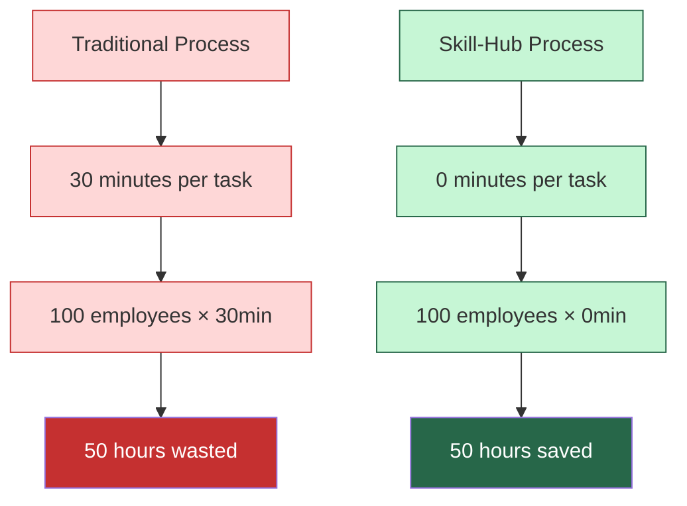
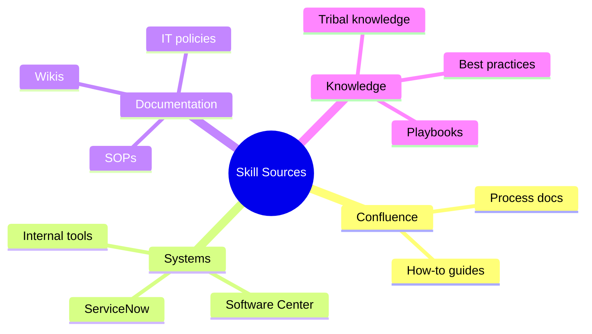
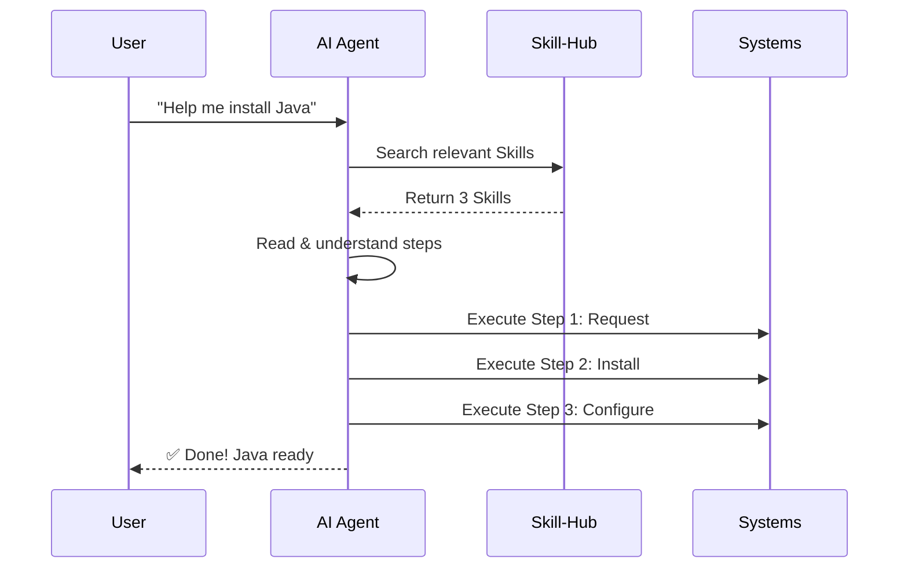
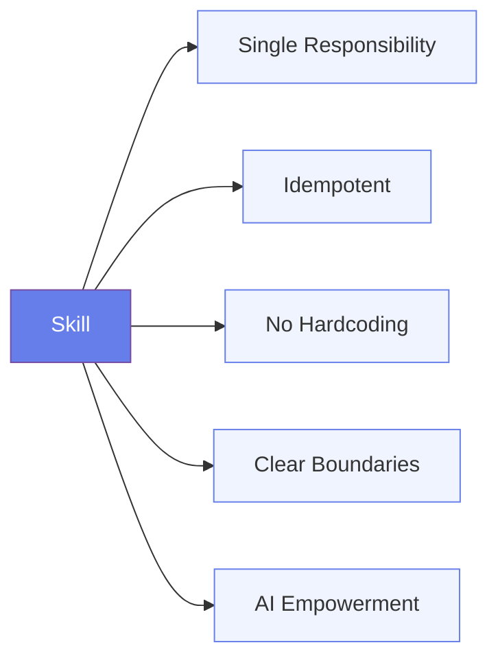

# Skill-Hub

> **Turn theoretical knowledge into AI execution capabilities**
>
> Documentation tells you how, Skill-Hub lets AI do it for you.

---

## 🎯 Core Value


**Transform**: Manual process execution → AI automated workflows

| Before | After |
|--------|-------|
| 📖 Read docs | 💬 Say one sentence |
| 🔧 Manual steps | 🤖 AI executes |
| ⏱️ 30+ minutes | ⚡ 0 minutes |
| ❌ Error-prone | ✅ Consistent |

---

## 🚀 Quick Start

### 1. Install a Skill

```bash
skill install sn-request-software
```

### 2. Let AI Use It

```
User: "Help me install Java"
  ↓
AI reads Skills: sn-request-software → swc-install-package → env-configure-java
  ↓
AI executes automatically:
  1. Submit ServiceNow request
  2. Wait for approval (monitored by AI)
  3. Install via Software Center
  4. Configure JAVA_HOME
  ↓
✅ Java installed and configured
```

---

## 📊 Efficiency Impact



**Annual Impact** (100 employees, 5 tasks/month):
- ⏱️ **Time Saved**: 3,000 hours/year
- 💰 **Cost Saved**: $150,000/year (at $50/hour)
- 📈 **Productivity**: +15% efficiency gain

---

## 📚 What Can Become a Skill?

Any reusable operational knowledge:



**Examples**:
- 🎫 ServiceNow requests (software, permissions, access)
- 🔧 Environment configuration (Java, Node.js, Maven, Git)
- 📦 Software installation and setup
- 🔐 Security and compliance workflows
- 🚀 Deployment and release processes

---

## 🏗️ How It Works



**Key Insight**: Skills are **atomic operation manuals** for AI to read, not programs to execute.

---

## 🎓 Core Skills

| Domain | Skill | What It Does |
|--------|-------|--------------|
| 🎫 ServiceNow | `sn-request-software` | Request software installation |
| 🎫 ServiceNow | `sn-request-ad-group` | Request AD group permissions |
| 📦 Software Center | `swc-install-package` | Install approved software |
| ☕ Environment | `env-configure-java` | Configure Java environment |
| 🟢 Environment | `env-configure-nodejs` | Configure Node.js environment |
| 🐍 Environment | `env-configure-python` | Configure Python environment |
| 🔷 Environment | `env-configure-maven` | Configure Maven environment |
| 🔧 Environment | `env-configure-path` | Configure PATH variables |

👉 **See all skills**: Browse the [`.trae/skills/`](./.trae/skills/) directory

---

## 📐 Design Principles

All Skills follow these principles:



1. **Single Responsibility** - One Skill = One System + One Action
2. **Idempotency** - Check first, configure only if needed
3. **No Hardcoding** - Describe intent, not specific commands
4. **Prerequisite Check** - Stop if conditions not met
5. **Clear Boundaries** - Explicit about what it's NOT responsible for
6. **AI Empowerment** - AI handles orchestration and exceptions
7. **Structured Format** - Consistent template
8. **User Communication** - Clear messages at every step

📖 **Detailed guide**: [Skill Design Principles](./docs/SKILL-DESIGN-PRINCIPLES.md)

---

## 🤝 Contributing

### Create a Skill

```bash
1. Write SKILL.md (follow design principles)
2. Test locally
3. skill push ./.trae/skills/your-skill
4. Submit PR
```

### Skill Structure

```markdown
---
name: env-configure-java
description: Configure Java environment variables
version: 1.0.0
domain: env
action: configure
object: java
---

## Trigger Conditions
When to use this Skill

## Prerequisites
What must be in place first

## Execution Steps
Step-by-step operations

## Constraints
What this Skill is NOT responsible for

## Error Handling
Common errors and solutions
```

---

## 📖 Documentation

| Document | Purpose |
|----------|---------|
| [PRD](./docs/Skill-Hub-PRD.md) | Complete product requirements with architecture |
| [Design Principles](./docs/SKILL-DESIGN-PRINCIPLES.md) | Detailed Skill creation guidelines |
| [Usage Examples](./docs/SKILL-USAGE-EXAMPLES.md) | Real-world scenarios and workflows |

---

## 💡 Example Scenarios

### Scenario 1: New Employee Onboarding

```
User: "I'm a new developer, set up everything I need"

AI executes:
  ✅ Request development tools (sn-request-software)
  ✅ Request system access (sn-request-ad-group)
  ✅ Install approved software (swc-install-package)
  ✅ Configure environments (env-configure-*)
  
Result: Complete dev environment in 1 hour vs 2 days
```

### Scenario 2: Software Installation

```
User: "I need Java for my project"

AI executes:
  1. Check if Java already installed → No
  2. Submit ServiceNow request → REQ0012345
  3. Monitor approval status → Approved (2 days)
  4. Install via Software Center → Done
  5. Configure JAVA_HOME → Done
  
Result: Zero manual steps, fully automated
```

---

## 🌟 Showcase

Browse available Skills at: **https://waylondev.github.io/skill-hub/**

---

**Skill-Hub** - Where knowledge meets execution. 🚀
