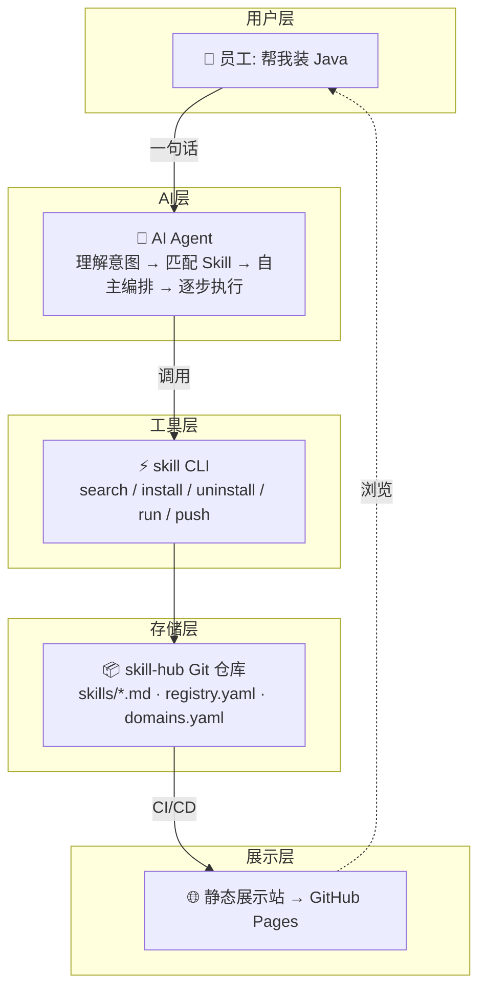
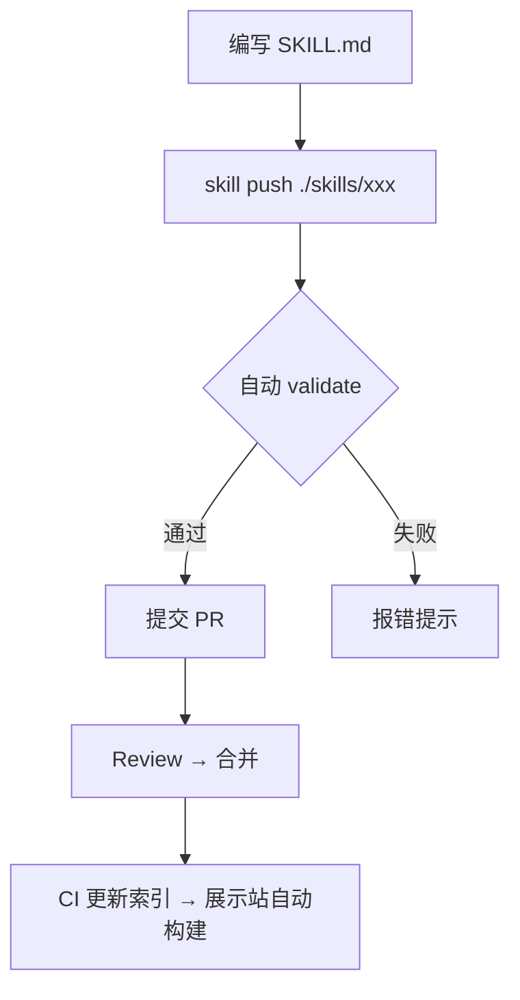
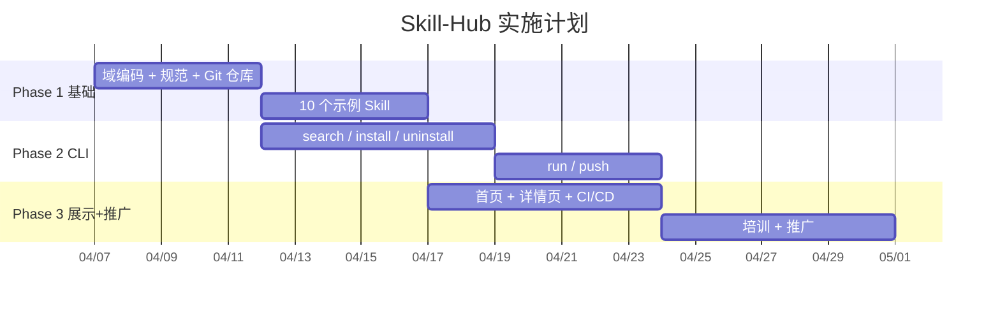

# Skill-Hub 产品需求文档 (PRD) v3.3

> **版本**：v3.3 | **日期**：2026-04-04
> **核心定位**：把 Confluence 的理论知识，变成 AI 帮你干活的能力
>
> **Skill 标准**：本项目遵循 [Agent Skills 官方最佳实践](./Agent-Skills-Best-Practices.md)，参考文档：
> - https://agentskills.io/home
> - https://agentskills.io/what-are-skills
> - https://agentskills.io/skill-creation/best-practices
> - https://agentskills.io/skill-creation/optimizing-descriptions

---

## 目录

- [1. 项目概述](#1-项目概述)
- [2. 整体架构](#2-整体架构)
- [3. Skill 定义规范](#3-skill-定义规范)
- [4. 命名规范](#4-命名规范)
- [5. Go CLI 工具](#5-go-cli-工具)
- [6. 仓库与发布](#6-仓库与发布)
- [7. 展示站](#7-展示站)
- [8. 实施路线图](#8-实施路线图)
- [9. 首批 Skill 清单](#9-首批-skill-清单)
- [变更记录](#变更记录)

---

## 1. 项目概述

### 1.1 问题：知识在 Confluence 里"睡觉"

集团内部存在大量**只有内部才知道的重复性流程**：

- 新员工入职要申请 VPN、Jenkins、ServiceNow、IKP、Vault、G3 等十几个系统的权限
- 安装软件要先在 ServiceNow 提申请，审批后推送到 Software Center，再安装，再配置环境变量
- 配置 Maven/Node 等包管理工具要连接内部 Nexus 镜像

**现状**：这些知识散落在 Confluence、飞书文档、老员工脑子里。

**本质问题**：Confluence 是**理论知识库**——你读完文档，知道了流程，然后**自己去操作**。每次都要：查文档 → 理解流程 → 打开对应系统 → 按步骤操作。知识停留在"被阅读"的阶段，从未转化为"被执行"的能力。

| | Confluence（现在） | Skill-Hub（未来） |
|---|---|---|
| **知识形态** | 文档，需要人去读 | 结构化指令，AI 直接执行 |
| **操作方式** | 人读文档 → 人去操作 | 人说一句话 → AI 帮你干 |
| **出错率** | 步骤多、系统多，容易遗漏 | AI 按指令逐步执行，不会遗漏 |
| **新人体验** | 找不到、找不全、找不准 | 说一句话，全程自动 |
| **老员工负担** | 反复回答同样的问题 | 知识沉淀为 Skill，一次编写永久复用 |

### 1.2 方案：让 AI 帮你干活

Skill-Hub 把 Confluence 里的**理论知识**转化为 AI Agent 可以直接执行的**操作能力**：

> **Confluence 告诉你怎么做，Skill-Hub 让 AI 帮你做。**

- **一个 Git 仓库**（`skill-hub`）存放所有 Skill
- **一个 Go CLI 工具**（5 个命令）管理 Skill 的搜索、安装、执行、发布
- **一个静态展示站**向全员宣传已有 Skill

**核心价值**：员工只需说一句话，AI Agent 自动完成原本需要查文档、跑流程、操作系统的全部工作。

### 1.3 为什么是 AI？——AI 的特性让 Skill 价值倍增

Skill 本身只是**原子操作说明书**，真正让它产生巨大价值的是 **AI Agent 的能力**：

| AI 特性 | 对 Skill-Hub 的意义 |
|---------|-------------------|
| **自然语言理解** | 员工不需要记命令，说"帮我装 Java"就行，AI 自动拆解意图 |
| **上下文推理** | AI 能判断前置条件——"你还没申请 Java，我先帮你提交申请" |
| **自主编排** | "装 Java"涉及 3 个系统 3 个 Skill，AI 自动决定调用顺序和时机 |
| **异常处理** | 审批被驳回？AI 告知原因并建议下一步，而不是卡住 |
| **持续学习** | 新增一个 Skill，所有员工立刻可用，无需培训 |
| **个性化适配** | 同一个 Skill，AI 根据用户角色、系统环境自动调整参数 |

**这就是为什么 Skill 只提供原子能力、不做编排**——编排是 AI 最擅长的事，写死在 Skill 里反而是限制。

### 1.4 什么是 Skill？

Skill 是一段**结构化的自然语言描述**，记录**某个系统**的某个操作的完整执行方式。

**Skill 不是什么**：
- ❌ 不是 CLI 工具的包装器（Agent 本来就会用 `jira`、`kubectl`、`docker`）
- ❌ 不是 API 调用封装
- ❌ 不是代码
- ❌ **不是流程编排**——编排是 AI Agent 的事

**Skill 是什么**：
- ✅ **一个系统 + 一个动作**——原子能力，不可再拆，绝对不做编排
- ✅ **只有内部才知道的操作知识**——哪个门户、审批链、内部地址、指定版本
- ✅ **高频重复的操作**——每个员工都要做的、每次都要查文档的事
- ✅ **从"看文档"到"帮你干"的桥梁**——把 Confluence 的理论知识变成 AI 的执行能力

### 1.5 Skill 粒度：只做原子能力，编排是 AI 的事

一个 Skill 只覆盖**一个系统的一个操作**。**Skill 绝对不做编排**——编排是 AI Agent 的职责。

**为什么 Skill 不做编排？**
- 编排需要理解上下文、判断前置条件、处理异常——这正是 AI Agent 擅长的
- 编排逻辑一旦写死在 Skill 里，就无法适应不同场景（"装 Java"和"装 Maven"的编排步骤不同）
- 原子 Skill 可以被 AI 自由组合，复用度远高于预定义流程

**示例：员工说"我要装 Java"**

这不是一个 Skill，而是一个流程，**AI 自主编排**多个原子 Skill：

```
sn-request-software     → 在 ServiceNow 提交 Java 安装申请
swc-install-package     → 在 Software Center 点击安装
env-configure-java      → 配置 JAVA_HOME 等环境变量
```

同理，"帮我配 Maven"的编排完全不同：

```
sn-request-software     → 在 ServiceNow 提交 Maven 安装申请
swc-install-package     → 在 Software Center 安装
env-configure-maven     → 配置 MAVEN_HOME、settings.xml
nexus-configure-maven   → 配置内部 Nexus 镜像
```

每个 Skill 只管自己那一步，AI 根据上下文决定调用顺序和时机。这就是 SOLID 的单一职责 + DRY 的复用。

> **Skill 只提供原子能力，不做编排。编排是 AI 的事。**

### 1.6 设计原则

| 原则 | 说明 |
|------|------|
| **CLI-first** | CLI 是唯一外部接口，任何能执行 Shell 的 Agent/人都能用 |
| **自然语言优先** | Skill 以自然语言描述为主，不依赖特定平台 |
| **协议无关** | 不绑定 MCP/A2A/任何协议 |
| **见名知意** | 域-动作-对象，从名称即可理解功能 |
| **不包装工具** | Skill 聚焦流程知识，不教 Agent 怎么用 CLI |
| **不做编排** | Skill 只提供原子能力，编排完全由 AI Agent 负责 |
| **单一职责** | 一个 Skill 只操作一个系统，保持原子性 |
| **幂等性** | 相同输入多次执行，结果一致 |
| **DRY** | 通用操作抽取为独立 Skill，AI 按需组合 |
| **KISS** | 步骤 ≤7，描述 ≤800 字 |

### 1.7 与外部 Skill 平台的区别

市面上已有一些 Skill 平台（如腾讯 SkillHub、ClawHub），但它们的定位与我们**完全不同**：

| | 腾讯 SkillHub / ClawHub | 我们的 Skill-Hub |
|---|---|---|
| **本质** | 技能分发平台（应用商店） | 内部流程知识库（操作说明书） |
| **Skill 来源** | 第三方开发者贡献，1.3 万+ | 内部员工编写，聚焦本集团 |
| **Skill 内容** | 代码/插件（可执行程序） | 自然语言描述（SKILL.md） |
| **核心价值** | 高速下载、精选榜单、安全审计 | 从"看文档"到"AI帮你干" |
| **解决的问题** | 海量技能的发现与安装 | 内部重复性流程的自动化 |
| **编排** | 无涉及 | AI Agent 自主编排 |
| **适用范围** | 通用，面向所有用户 | 企业内部，面向本集团员工 |

**一句话总结**：腾讯 SkillHub 是"应用商店"，帮你找到并安装工具；我们的 Skill-Hub 是"操作手册"，让 AI 帮你执行内部流程。两者互补，不冲突。

### 1.8 目标用户

| 角色 | 场景 |
|------|------|
| Skill 作者 | 编写 SKILL.md，push 到仓库 |
| AI Agent | 读取 Skill，理解意图，编排执行，处理异常 |
| 开发者 | 通过 CLI 搜索、安装、使用 Skill |
| 普通员工 | 在展示站浏览 Skill，或直接对 AI 说一句话 |

---

## 2. 整体架构



**核心数据流**：

```
员工："帮我装 Java"
  → AI 理解意图，匹配到 3 个原子 Skill
  → AI 编排执行顺序：sn-request-software → swc-install-package → env-configure-java
  → 每步操作一个系统，AI 处理前置条件检查和异常
  → 从"查 Confluence 自己干"变成"AI 帮你干"
```

---

## 3. Skill 定义规范

> **重要**：本节内容基于 [Agent Skills 最佳实践](./Agent-Skills-Best-Practices.md)，请先阅读该文档了解完整的官方标准。

### 3.1 目录结构

```
skill-hub/skills/
├── sn-request-software/          # ServiceNow: 申请软件
│   └── SKILL.md
├── swc-install-package/          # Software Center: 安装软件
│   └── SKILL.md
├── env-configure-java/           # 环境变量: 配置 Java
│   └── SKILL.md
├── sn-request-permission/        # ServiceNow: 申请权限
│   └── SKILL.md
├── nexus-configure-maven/        # Nexus: 配置 Maven 镜像
│   └── SKILL.md
└── ...
```

**扁平化**：名称含域前缀，`ls` 即可按前缀分组，无需嵌套目录。

### 3.2 SKILL.md 格式

YAML frontmatter + Markdown body，兼容 Claude Code / Cursor / Copilot 原生识别。

#### 示例 1：ServiceNow 申请软件

> `skills/sn-request-software/SKILL.md`

**Frontmatter：**

```yaml
name: sn-request-software
description: >-
  Use this skill when the user wants to request software, apply for Java installation,
  or submit a software request in ServiceNow.
version: 1.0.0
displayName: ServiceNow 申请软件
author: zhangsan
team: platform
domain: sn
action: request
object: software
tags: [servicenow, software, apply, install]
type: SKILL
inputs:
  - name: software_name
    type: string
    required: true
    description: 软件名称（如 Java、IntelliJ IDEA、Node.js）
  - name: applicant
    type: string
    required: true
    description: 申请人姓名或工号
  - name: reason
    type: string
    required: true
    description: 申请理由
  - name: version
    type: string
    required: false
    description: 指定版本（如不指定则安装最新版）
```

**Body：**

```markdown
# ServiceNow 申请软件

## 触发条件
员工需要申请安装公司提供的软件时使用（Java、IDE、数据库客户端等）。

## 角色定义
你是 IT 软件申请助手，熟悉 ServiceNow 软件申请流程。

## 执行步骤
1. 确认申请信息：软件 {{software_name}}，申请人 {{applicant}}，版本 {{version}}

2. 检查是否已申请过：
   - 登录 ServiceNow：https://company.service-now.com
   - 进入"软件请求"页面，搜索 {{applicant}} 的历史申请

3. 如未申请，提交新申请：
   - 打开：https://company.service-now.com/sp?id=sc_cat_item&sys_id=software_request
   - 填写：
     - 软件名称：{{software_name}}
     - 版本：{{version}}（如未指定填"最新版"）
     - 申请人：{{applicant}}
     - 申请理由：{{reason}}

4. 告知后续流程：
   - 审批通过后，软件会自动推送到你的 Software Center
   - 预计审批时间：1-2 个工作日
   - 推送后你会收到邮件通知

## 约束
- 只负责 ServiceNow 上的申请操作，不负责安装和配置
- 幂等：已存在未过期的申请则直接告知状态，不重复提交
```

#### 示例 2：Software Center 安装软件

> `skills/swc-install-package/SKILL.md`

**Frontmatter：**

```yaml
name: swc-install-package
description: >-
  Use this skill when the user wants to install software, install in Software Center,
  or install approved software.
version: 1.0.0
displayName: Software Center 安装软件
domain: swc
action: install
object: package
tags: [software-center, install, package]
type: SKILL
inputs:
  - name: package_name
    type: string
    required: true
    description: 软件包名称
```

**Body：**

```markdown
# Software Center 安装软件

## 触发条件
软件已在 ServiceNow 审批通过并推送到 Software Center，需要执行安装时使用。

## 前置条件
- 软件必须已在 ServiceNow 审批通过
- 如未审批，先使用 sn-request-software 提交申请

## 执行步骤
1. 确认软件名称：{{package_name}}

2. 打开 Software Center：
   - Windows：开始菜单搜索"Software Center"
   - macOS：从 Self Service 应用打开

3. 搜索 {{package_name}}，点击"安装"

4. 等待安装完成，确认状态显示"已安装"

## 约束
- 只负责 Software Center 上的安装操作
- 不负责环境变量配置（使用 env-configure-* 系列 Skill）
- 幂等：已安装则直接告知
```

#### 示例 3：配置 Java 环境变量

> `skills/env-configure-java/SKILL.md`

**Frontmatter：**

```yaml
name: env-configure-java
description: >-
  Use this skill when the user wants to configure Java environment variables, set up JAVA_HOME,
  or configure JDK environment variables.
version: 1.0.0
displayName: 配置 Java 环境变量
domain: env
action: configure
object: java
tags: [env, java, jdk, config]
type: SKILL
inputs:
  - name: java_home
    type: string
    required: false
    description: Java 安装路径（如不指定则自动检测）
```

**Body：**

```markdown
# 配置 Java 环境变量

## 触发条件
Java 已安装完成，需要配置环境变量时使用。

## 前置条件
- Java 已安装（通过 Software Center 或其他方式）
- 如未安装，先使用 sn-request-software + swc-install-package

## 执行步骤
1. 检测 Java 安装路径：
   ```bash
   /usr/libexec/java_home -V 2>/dev/null   # macOS
   ls /usr/lib/jvm/                           # Linux
   ```
   如指定了 {{java_home}} 则直接使用。

2. 配置环境变量：

   **macOS / Linux**（写入 ~/.bashrc 或 ~/.zshrc）：
   ```bash
   export JAVA_HOME={{java_home}}
   export PATH=$JAVA_HOME/bin:$PATH
   ```

   **Windows**（系统环境变量）：
   - JAVA_HOME → {{java_home}}
   - Path 添加 %JAVA_HOME%\bin

3. 验证：
   ```bash
   source ~/.bashrc   # 或重新打开终端
   java -version
   echo $JAVA_HOME
   ```

## 约束
- 只负责环境变量配置，不负责安装 Java
- 幂等：已配置则检查是否正确，不重复写入
```

### 3.3 Frontmatter Schema

| 字段 | 类型 | 必需 | 说明 |
|------|------|------|------|
| `name` | string | **是** | 唯一标识，kebab-case，≤40 字符 |
| `description` | string | **是** | 功能描述 + 触发短语，≤2000 字符 |
| `version` | string | **是** | semver |
| `displayName` | string | 否 | 中文名称 |
| `author` | string | 否 | 作者 |
| `team` | string | 否 | 维护团队 |
| `domain` | string | **是** | 系统编码 |
| `action` | string | **是** | 动作（动词原形） |
| `object` | string | **是** | 操作对象 |
| `tags` | string[] | 否 | 标签 |
| `inputs` | InputDef[] | 否 | 输入参数 |

### 3.4 Body 推荐结构

> 参考 [Agent Skills 最佳实践 §3.2](./Agent-Skills-Best-Practices.md#32-body-推荐结构)

| 章节 | 用途 | 必需 |
|------|------|------|
| `## 触发条件` | 何时使用 | ✅ |
| `## 前置条件` | 依赖的系统状态（AI 据此判断是否需要先调用其他 Skill） | ✅ |
| `## 执行步骤` | 具体操作（含内部地址、审批链等） | ✅ |
| `## 约束` | 边界 + 幂等性保障 | ✅ |

**不推荐包含**：
- 相关 Skill 列表（AI 会自主发现）
- 过多可选配置示例
- 冗长的背景说明

---

## 4. 命名规范

格式：**`{domain}-{action}-{object}`**

**域编码**（按系统划分）：

| 域 | 系统 | 示例 |
|----|------|------|
| `sn` | ServiceNow | `sn-request-software`、`sn-request-permission` |
| `swc` | Software Center | `swc-install-package`、`swc-query-status` |
| `env` | 环境变量 | `env-configure-java`、`env-configure-maven` |
| `nexus` | Nexus 制品仓库 | `nexus-configure-maven`、`nexus-configure-npm` |
| `vpn` | VPN | `vpn-apply-permission` |
| `hr` | 人力资源系统 | `hr-query-leave` |
| `doc` | 文档系统 | `doc-generate-report` |

**规则**：全小写英文，连字符连接，总长 ≤40 字符，域编码管理员统一维护。

---

## 5. CLI 工具

### 5.1 命令（5 个）

| 命令 | 说明 | 示例 |
|------|------|------|
| `skill search <关键词>` | 搜索 | `skill search java`、`skill search --domain sn` |
| `skill install <name>` | 安装到本地 | `skill install sn-request-software` |
| `skill uninstall <name>` | 卸载 | `skill uninstall sn-request-software` |
| `skill run <name>` | 执行 | `skill run sn-request-software` |
| `skill push <path>` | 发布（自动 validate） | `skill push ./skills/sn-request-software` |

### 5.2 实现方案

**Go + Cobra**——业内最主流的 CLI 方案（kubectl、docker、gh、hugo、terraform 都用它）。

| 方案 | 用户依赖 | 安装方式 | 优势 | 劣势 |
|------|---------|---------|------|------|
| **Go + Cobra** ✅ | 无 | GitHub Releases 下载单二进制 | 跨平台、Agent 友好、生态成熟 | 需构建流水线 |
| Rust + Clap | 无 | GitHub Releases 下载单二进制 | 性能极致、类型安全 | 学习曲线陡，编译慢 |
| 纯 Shell 脚本 | git bash | `curl \| bash` | 零依赖、最简单 | 复杂逻辑难维护，Windows 兼容性差 |

**选择 Go + Cobra 的理由**：
- **用户无需安装 Go**——编译后是单个静态二进制，下载即用
- **CLI 是 LLM 的母语**——Agent 用 CLI 的 token 消耗比 MCP 便宜 10-32 倍，Cobra 自动生成 `--help` 和 shell 补全，天然 Agent 友好
- **GoReleaser 一键发布**——push tag 自动构建多平台二进制 + 发布到 GitHub Releases
- 5 个子命令 + YAML 解析 + Git 操作 + 参数校验，Go 处理这些比 Shell 可靠得多

### 5.3 技术栈

| 库 | 用途 |
|----|------|
| `cobra` | 命令行框架（子命令树、`--help` 自动生成、shell 补全） |
| `viper` | 配置管理 |
| `go-git` | Git 操作 |
| `pterm` | 终端 UI（彩色输出、进度条） |
| `goreleaser` | 多平台构建 + GitHub Releases 发布 |

### 5.4 项目结构

```
skill-hub-cli/
├── cmd/
│   ├── root.go
│   ├── search.go
│   ├── install.go
│   ├── uninstall.go
│   ├── run.go
│   └── push.go
├── internal/
│   ├── parser.go
│   ├── validator.go
│   └── registry.go
├── .goreleaser.yaml
├── go.mod
└── Makefile
```

### 5.5 安装方式

```bash
# 一键安装（macOS / Linux）
curl -fsSL https://github.com/company/skill-hub-cli/releases/latest/download/skill_$(uname -s)_$(uname -m) -o /usr/local/bin/skill && chmod +x /usr/local/bin/skill

# 或从 GitHub Releases 页面下载
# https://github.com/company/skill-hub-cli/releases
```

安装后 `skill --help` 即可使用。

---

## 6. 仓库与发布

### 6.1 仓库结构

```
skill-hub/
├── skills/
│   ├── sn-request-software/SKILL.md
│   ├── sn-request-permission/SKILL.md
│   ├── swc-install-package/SKILL.md
│   ├── env-configure-java/SKILL.md
│   ├── env-configure-maven/SKILL.md
│   ├── env-configure-node/SKILL.md
│   ├── nexus-configure-maven/SKILL.md
│   ├── nexus-configure-npm/SKILL.md
│   ├── vpn-apply-permission/SKILL.md
│   ├── hr-query-leave/SKILL.md
│   └── doc-generate-report/SKILL.md
├── registry.yaml
├── domains.yaml
└── README.md
```

### 6.2 发布流程



---

## 7. 展示站

**技术**：Hugo/Astro + Pagefind + GitHub Pages

**核心功能**：
- **搜索**：支持中文关键词搜索，按域/标签过滤
- **精选榜单**：按使用频率排序的 Top Skill，新人照着装就行
- **一句话安装**：每个 Skill 详情页提供一键复制的安装+执行命令
- **分类浏览**：按域编码分组（sn、swc、env、nexus 等）

```
┌─────────────────────────────────────────────────┐
│  Skill-Hub              [ 搜索 Skill... ]       │
├─────────────────────────────────────────────────┤
│  快速开始                                        │
│  $ skill install sn-request-software    [复制]  │
│  $ skill run sn-request-software        [复制]  │
│                                                 │
│  按系统浏览                                      │
│  [sn·2] [swc·1] [env·3] [nexus·2] [vpn·1]   │
│                                                 │
│  精选榜单（按使用频率排序）                        │
│  🥇 sn-request-software    申请软件        2.3k  │
│  🥈 env-configure-java    配置Java环境    1.8k  │
│  🥉 swc-install-package   安装已审批软件  1.5k  │
│     nexus-configure-maven 配置Maven镜像  1.2k  │
│     vpn-apply-permission  申请VPN权限    0.9k  │
└─────────────────────────────────────────────────┘
```

---

## 8. 实施路线图



---

## 9. 首批 Skill 清单

### ServiceNow（软件与权限申请）

| 名称 | 标题 | 说明 |
|------|------|------|
| `sn-request-software` | 申请软件 | 在 ServiceNow 提交软件安装申请 |
| `sn-request-permission` | 申请系统权限 | 在 ServiceNow 提交系统权限申请 |
| `sn-query-request` | 查询申请状态 | 查询 ServiceNow 工单的审批进度 |

### Software Center（软件安装）

| 名称 | 标题 | 说明 |
|------|------|------|
| `swc-install-package` | 安装已审批软件 | 在 Software Center 安装已推送的软件 |
| `swc-query-status` | 查询安装状态 | 查看软件安装进度和状态 |

### 环境配置

| 名称 | 标题 | 说明 |
|------|------|------|
| `env-configure-java` | 配置 Java 环境变量 | JAVA_HOME、PATH 配置 |
| `env-configure-maven` | 配置 Maven 环境变量 | MAVEN_HOME、settings.xml |
| `env-configure-node` | 配置 Node.js 环境变量 | NODE_PATH、.npmrc |

### Nexus（包管理镜像）

| 名称 | 标题 | 说明 |
|------|------|------|
| `nexus-configure-maven` | 配置 Maven Nexus 镜像 | settings.xml 添加内部 Nexus 仓库 |
| `nexus-configure-npm` | 配置 npm Nexus 镜像 | .npmrc 设置 registry |

### VPN

| 名称 | 标题 | 说明 |
|------|------|------|
| `vpn-apply-permission` | 申请 VPN 权限 | VPN 接入申请流程和审批链 |

### 其他

| 名称 | 标题 | 说明 |
|------|------|------|
| `hr-query-leave` | 查询年假余额 | 年假、调休查询方式 |
| `doc-generate-report` | 生成标准化报告 | 周报/月报模板和规范 |

---

## 变更记录

| 版本 | 变更 |
|------|------|
| v1.0 | 初始版本 |
| v2.0 | SKILL.md + 编排 + 评估 + 存储演进 |
| v3.0 | 极简重构：5 个 CLI 命令；移除编排/评估/服务化；扁平目录；Skill 聚焦内部流程知识 |
| v3.1 | **价值终版**：强化"从看文档到 AI 帮你干"价值主张；新增 AI 特性阐述；合并设计原则表；强化"Skill 不做编排" |
| v3.2 | **竞品对标 + CLI 选型**：新增 §1.7 与腾讯 SkillHub 对比；展示站增加精选榜单；CLI 方案对比后选定 **Go + Cobra**（用户无需装 Go，单二进制下载即用） |
| v3.3 | **Agent Skills 官方标准**：新增 [Agent-Skills-Best-Practices.md](./Agent-Skills-Best-Practices.md) 文档；Skill 描述改用英文命令式 "Use this skill when..."；精简冗余信息；添加官方参考链接 |
