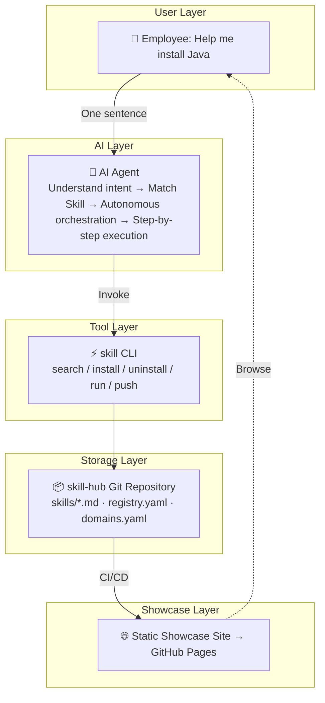
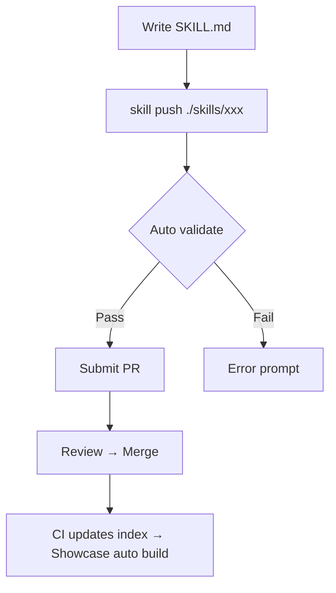
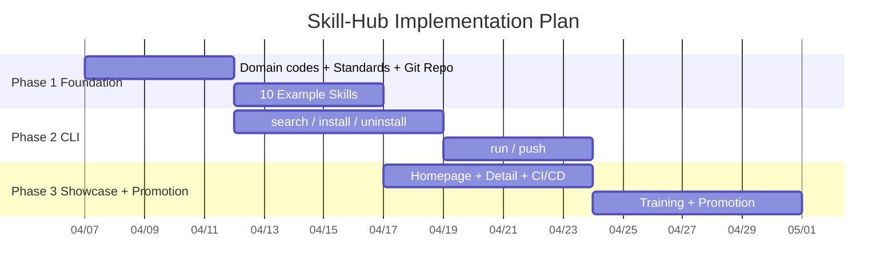

# Skill-Hub Product Requirements Document (PRD) v3.3

> **Version**: v3.3 | **Date**: 2026-04-04
> **Core Positioning**: Turn Confluence theoretical knowledge into AI execution capabilities
>
> **Skill Standards**: This project follows [Agent Skills Best Practices](./Agent-Skills-Best-Practices.md), reference documents:
> - https://agentskills.io/home
> - https://agentskills.io/what-are-skills
> - https://agentskills.io/skill-creation/best-practices
> - https://agentskills.io/skill-creation/optimizing-descriptions

---

## Table of Contents

- [1. Project Overview](#1-project-overview)
- [2. Architecture](#2-architecture)
- [3. Skill Definition Standards](#3-skill-definition-standards)
- [4. Naming Conventions](#4-naming-conventions)
- [5. Go CLI Tool](#5-go-cli-tool)
- [6. Repository and Release](#6-repository-and-release)
- [7. Showcase Site](#7-showcase-site)
- [8. Implementation Roadmap](#8-implementation-roadmap)
- [9. Initial Skill List](#9-initial-skill-list)
- [Change Log](#change-log)

---

## 1. Project Overview

### 1.1 Problem: Knowledge "Sleeps" in Confluence

Organizations have numerous **internal-only repetitive processes**:

- New employees need to apply for access to VPN, Jenkins, ServiceNow, IKP, Vault, G3, and more
- Installing software requires ServiceNow requests, approval, Software Center push, installation, then environment configuration
- Configuring Maven/Node package managers requires connecting to internal Nexus mirrors

**Current State**: This knowledge is scattered across Confluence, Lark docs, and senior employees' minds.

**Core Issue**: Confluence is a **theoretical knowledge base**—you read the docs, understand the process, then **do it yourself**. Every time: search docs → understand process → open systems → follow steps. Knowledge stays at the "read" stage, never becoming "executed" capability.

| | Confluence (Current) | Skill-Hub (Future) |
|---|---|---|
| **Knowledge Form** | Documents requiring human reading | Structured instructions for AI direct execution |
| **Operation Mode** | Human reads docs → Human operates | Human speaks one sentence → AI does it |
| **Error Rate** | Many steps, many systems, easy to miss | AI executes step by step, no omissions |
| **New Hire Experience** | Can't find, can't find all, can't find accurately | Speak one sentence, fully automated |
| **Senior Employee Burden** | Repeatedly answer same questions | Knowledge沉淀 as Skill, write once reuse forever |

### 1.2 Solution: Let AI Do the Work

Skill-Hub transforms Confluence **theoretical knowledge** into **operational capabilities** that AI Agents can directly execute:

> **Confluence tells you how to do it, Skill-Hub lets AI do it for you.**

- **One Git repository** (`skill-hub`) stores all Skills
- **One Go CLI tool** (5 commands) manages Skill search, install, run, publish
- **One static showcase site** promotes available Skills to all employees

**Core Value**: Employees just say one sentence, AI Agent automatically completes all work that originally required searching docs, running processes, and operating systems.

### 1.3 Why AI? — AI Characteristics Multiply Skill Value

Skills are just **atomic operation manuals**; what creates huge value is **AI Agent capabilities**:

| AI Characteristic | Significance for Skill-Hub |
|-------------------|---------------------------|
| **Natural Language Understanding** | Employees don't need to remember commands, just say "help me install Java", AI automatically parses intent |
| **Context Reasoning** | AI can judge preconditions—"You haven't applied for Java yet, let me submit the application first" |
| **Autonomous Orchestration** | "Install Java" involves 3 systems and 3 Skills, AI automatically decides execution order and timing |
| **Exception Handling** | Approval rejected? AI informs reason and suggests next steps, instead of getting stuck |
| **Continuous Learning** | Add one new Skill, all employees can use it immediately, no training needed |
| **Personalized Adaptation** | Same Skill, AI automatically adjusts parameters based on user role and system environment |

**This is why Skills only provide atomic capabilities, not orchestration**—orchestration is what AI does best, writing it into Skills is limiting.

### 1.4 What is a Skill?

A Skill is a **structured natural language description** documenting the complete execution method of an operation in **a specific system**.

**What Skill is NOT**:
- ❌ Not a CLI tool wrapper (Agents already know how to use `jira`, `kubectl`, `docker`)
- ❌ Not an API call encapsulation
- ❌ Not code
- ❌ **Not process orchestration**—orchestration is AI Agent's job

**What Skill IS**:
- ✅ **One system + One action**—atomic capability, indivisible, absolutely no orchestration
- ✅ **Internal-only operational knowledge**—which portal, approval chain, internal address, specified version
- ✅ **High-frequency repetitive operations**—what every employee does, what requires checking docs every time
- ✅ **Bridge from "reading docs" to "doing for you"**—turn Confluence theoretical knowledge into AI execution capability

### 1.5 Skill Granularity: Only Atomic Capabilities, Orchestration is AI's Job

One Skill only covers **one operation in one system**. **Skills absolutely do not orchestrate**—orchestration is AI Agent's responsibility.

**Why Skills Don't Orchestrate?**
- Orchestration requires understanding context, judging preconditions, handling exceptions—this is what AI Agent excels at
- Once orchestration logic is hardcoded in Skills, it can't adapt to different scenarios ("install Java" and "install Maven" have different orchestration steps)
- Atomic Skills can be freely combined by AI, much higher reusability than predefined processes

**Example**: Employee says "I want to install Java"

This is not one Skill, but a process, **AI autonomously orchestrates** multiple atomic Skills:

```
sn-request-software     → Submit Java installation request in ServiceNow
swc-install-package     → Click install in Software Center
env-configure-java      → Configure JAVA_HOME and other environment variables
```

Similarly, "help me configure Maven" has completely different orchestration:

```
sn-request-software     → Submit Maven installation request in ServiceNow
swc-install-package     → Install in Software Center
env-configure-maven     → Configure MAVEN_HOME, settings.xml
nexus-configure-maven   → Configure internal Nexus mirror
```

Each Skill only manages its own step, AI decides execution order and timing based on context. This is SOLID single responsibility + DRY reuse.

> **Skills only provide atomic capabilities, not orchestration. Orchestration is AI's job.**

### 1.6 Design Principles

| Principle | Description |
|-----------|-------------|
| **CLI-first** | CLI is the only external interface, any Agent/person that can execute Shell can use it |
| **Natural Language First** | Skills primarily use natural language descriptions, not tied to specific platforms |
| **Protocol Agnostic** | Not bound to MCP/A2A/any protocol |
| **Self-Explanatory Names** | Domain-action-object, function understandable from name |
| **No Tool Wrapping** | Skills focus on process knowledge, don't teach Agent how to use CLI |
| **No Orchestration** | Skills only provide atomic capabilities, orchestration fully handled by AI Agent |
| **Single Responsibility** | One Skill only operates one system, maintains atomicity |
| **Idempotency** | Same input executed multiple times, consistent results |
| **DRY** | General operations extracted as independent Skills, AI combines as needed |
| **KISS** | Steps ≤7, description ≤800 words |

### 1.7 Differences from External Skill Platforms

Existing Skill platforms (like Tencent SkillHub, ClawHub) have completely different positioning from ours:

| | Tencent SkillHub / ClawHub | Our Skill-Hub |
|---|---|---|
| **Essence** | Skill distribution platform (app store) | Internal process knowledge base (operation manual) |
| **Skill Source** | Third-party developers contribute, 13,000+ | Internal employees write, focused on organization |
| **Skill Content** | Code/plugins (executable programs) | Natural language descriptions (SKILL.md) |
| **Core Value** | Fast download, featured lists, security audit | From "reading docs" to "AI doing for you" |
| **Problem Solved** | Discovery and installation of massive skills | Automation of internal repetitive processes |
| **Orchestration** | Not involved | AI Agent autonomous orchestration |
| **Scope** | Universal, for all users | Enterprise internal, for organization employees |

**One-sentence summary**: Tencent SkillHub is an "app store" to help you find and install tools; our Skill-Hub is an "operation manual" to let AI execute internal processes for you. They complement each other, no conflict.

### 1.8 Target Users

| Role | Scenario |
|------|----------|
| Skill Author | Write SKILL.md, push to repository |
| AI Agent | Read Skills, understand intent, orchestrate execution, handle exceptions |
| Developer | Search, install, use Skills via CLI |
| Regular Employee | Browse Skills on showcase site, or directly speak one sentence to AI |

---

## 2. Architecture



**Core Data Flow**:

```
Employee: "Help me install Java"
  → AI understands intent, matches to 3 atomic Skills
  → AI orchestrates execution order: sn-request-software → swc-install-package → env-configure-java
  → Each step operates one system, AI handles precondition checks and exceptions
  → From "search Confluence and do it yourself" to "AI does it for you"
```

---

## 3. Skill Definition Standards

> **Important**: This section is based on [Agent Skills Best Practices](./Agent-Skills-Best-Practices.md), please read that document first for complete official standards.

### 3.1 Directory Structure

```
skill-hub/skills/
├── sn-request-software/          # ServiceNow: Request software
│   └── SKILL.md
├── swc-install-package/          # Software Center: Install software
│   └── SKILL.md
├── env-configure-java/           # Environment: Configure Java
│   └── SKILL.md
├── sn-request-permission/        # ServiceNow: Request permission
│   └── SKILL.md
├── nexus-configure-maven/        # Nexus: Configure Maven mirror
│   └── SKILL.md
└── ...
```

**Flat**: Names contain domain prefix, `ls` can group by prefix, no nested directories needed.

### 3.2 SKILL.md Format

YAML frontmatter + Markdown body, compatible with Claude Code / Cursor / Copilot native recognition.

#### Example 1: ServiceNow Request Software

> `skills/sn-request-software/SKILL.md`

**Frontmatter:**

```yaml
name: sn-request-software
description: >-
  Use this skill when the user wants to request software, apply for Java installation,
  or submit a software request in ServiceNow.
version: 1.0.0
displayName: ServiceNow Request Software
author: zhangsan
team: platform
domain: sn
action: request
object: software
tags: [servicenow, software, apply, install]
type: SKILL
inputs:
  - name: software_name
    type: string
    required: true
    description: Software name (e.g., Java, IntelliJ IDEA, Node.js)
  - name: applicant
    type: string
    required: true
    description: Applicant name or employee ID
  - name: reason
    type: string
    required: true
    description: Application reason
  - name: version
    type: string
    required: false
    description: Specified version (latest if not specified)
```

**Body:**

```markdown
# ServiceNow Request Software

## Trigger Conditions
Use when employees need to apply for company-provided software (Java, IDE, database clients, etc.).

## Role Definition
You are an IT software application assistant, familiar with ServiceNow software application process.

## Execution Steps
1. Confirm application information: software {{software_name}}, applicant {{applicant}}, version {{version}}

2. Check if already applied:
   - Log in to ServiceNow: https://company.service-now.com
   - Go to "Software Request" page, search {{applicant}}'s history

3. If not applied, submit new application:
   - Open: https://company.service-now.com/sp?id=sc_cat_item&sys_id=software_request
   - Fill in:
     - Software name: {{software_name}}
     - Version: {{version}} (fill "latest" if not specified)
     - Applicant: {{applicant}}
     - Application reason: {{reason}}

4. Inform follow-up process:
   - After approval, software will be automatically pushed to your Software Center
   - Estimated approval time: 1-2 business days
   - You will receive email notification after push

## Constraints
- Only responsible for ServiceNow application operation, not installation and configuration
- Idempotent: if existing unexpired application exists, directly inform status, do not resubmit
```

### 3.3 Frontmatter Schema

| Field | Type | Required | Description |
|-------|------|----------|-------------|
| `name` | string | **Yes** | Unique identifier, kebab-case, ≤40 chars |
| `description` | string | **Yes** | Function description + trigger phrases, ≤2000 chars |
| `version` | string | **Yes** | semver |
| `displayName` | string | No | Display name |
| `author` | string | No | Author |
| `team` | string | No | Maintenance team |
| `domain` | string | **Yes** | System code |
| `action` | string | **Yes** | Action (verb base form) |
| `object` | string | **Yes** | Operation object |
| `tags` | string[] | No | Tags |
| `inputs` | InputDef[] | No | Input parameters |

### 3.4 Body Recommended Structure

> Reference [Agent Skills Best Practices §3.2](./Agent-Skills-Best-Practices.md#32-body-recommended-structure)

| Section | Purpose | Required |
|---------|---------|----------|
| `## Trigger Conditions` | When to use | ✅ |
| `## Prerequisites` | Dependent system state | ✅ |
| `## Execution Steps` | Specific operations | ✅ |
| `## Constraints` | Boundaries + idempotency | ✅ |

**Not recommended to include**:
- Related Skill lists (AI will discover autonomously)
- Too many optional configuration examples
- Lengthy background explanations

---

## 4. Naming Conventions

Format: **`{domain}-{action}-{object}`**

**Domain Codes** (by system):

| Domain | System | Example |
|--------|--------|---------|
| `sn` | ServiceNow | `sn-request-software`, `sn-request-permission` |
| `swc` | Software Center | `swc-install-package`, `swc-query-status` |
| `env` | Environment Variables | `env-configure-java`, `env-configure-maven` |
| `nexus` | Nexus Artifact Repository | `nexus-configure-maven`, `nexus-configure-npm` |
| `vpn` | VPN | `vpn-apply-permission` |
| `hr` | HR System | `hr-query-leave` |
| `doc` | Document System | `doc-generate-report` |

**Rules**: All lowercase English, hyphen-connected, total length ≤40 chars, domain codes maintained by admin.

---

## 5. Go CLI Tool

### 5.1 Commands (5)

| Command | Description | Example |
|---------|-------------|---------|
| `skill search <keyword>` | Search | `skill search java`, `skill search --domain sn` |
| `skill install <name>` | Install locally | `skill install sn-request-software` |
| `skill uninstall <name>` | Uninstall | `skill uninstall sn-request-software` |
| `skill run <name>` | Execute | `skill run sn-request-software` |
| `skill push <path>` | Publish (auto validate) | `skill push ./skills/sn-request-software` |

### 5.2 Implementation

**Go + Cobra**—industry mainstream CLI solution (kubectl, docker, gh, hugo, terraform all use it).

**Tech Stack**:

| Library | Purpose |
|---------|---------|
| `cobra` | CLI framework (subcommand tree, `--help` auto-generation, shell completion) |
| `viper` | Configuration management |
| `go-git` | Git operations |
| `pterm` | Terminal UI (colored output, progress bars) |
| `goreleaser` | Multi-platform build + GitHub Releases publish |

---

## 6. Repository and Release

### 6.1 Repository Structure

```
skill-hub/
├── skills/
│   ├── sn-request-software/SKILL.md
│   ├── sn-request-permission/SKILL.md
│   ├── swc-install-package/SKILL.md
│   ├── env-configure-java/SKILL.md
│   ├── env-configure-maven/SKILL.md
│   ├── env-configure-node/SKILL.md
│   ├── nexus-configure-maven/SKILL.md
│   ├── nexus-configure-npm/SKILL.md
│   ├── vpn-apply-permission/SKILL.md
│   ├── hr-query-leave/SKILL.md
│   └── doc-generate-report/SKILL.md
├── registry.yaml
├── domains.yaml
└── README.md
```

### 6.2 Release Process



---

## 7. Showcase Site

**Tech**: Hugo/Astro + Pagefind + GitHub Pages

**Core Features**:
- **Search**: Support Chinese keyword search, filter by domain/tag
- **Featured Lists**: Top Skills sorted by usage frequency, new hires can follow
- **One-sentence Install**: Each Skill detail page provides one-click copy install+run command
- **Category Browse**: Group by domain code (sn, swc, env, nexus, etc.)

---

## 8. Implementation Roadmap



---

## 9. Initial Skill List

### ServiceNow (Software and Permission Requests)

| Name | Title | Description |
|------|-------|-------------|
| `sn-request-software` | Request Software | Submit software installation request in ServiceNow |
| `sn-request-permission` | Request System Permission | Submit system permission request in ServiceNow |
| `sn-query-request` | Query Request Status | Query ServiceNow ticket approval progress |

### Software Center (Software Installation)

| Name | Title | Description |
|------|-------|-------------|
| `swc-install-package` | Install Approved Software | Install pushed software in Software Center |
| `swc-query-status` | Query Installation Status | View software installation progress and status |

### Environment Configuration

| Name | Title | Description |
|------|-------|-------------|
| `env-configure-java` | Configure Java Environment | JAVA_HOME, PATH configuration |
| `env-configure-maven` | Configure Maven Environment | MAVEN_HOME, settings.xml |
| `env-configure-node` | Configure Node.js Environment | NODE_PATH, .npmrc |

### Nexus (Package Manager Mirrors)

| Name | Title | Description |
|------|-------|-------------|
| `nexus-configure-maven` | Configure Maven Nexus Mirror | Add internal Nexus repository to settings.xml |
| `nexus-configure-npm` | Configure npm Nexus Mirror | Set registry in .npmrc |

### VPN

| Name | Title | Description |
|------|-------|-------------|
| `vpn-apply-permission` | Apply for VPN Permission | VPN access application process and approval chain |

### Others

| Name | Title | Description |
|------|-------|-------------|
| `hr-query-leave` | Query Annual Leave Balance | Annual leave, compensatory leave query methods |
| `doc-generate-report` | Generate Standardized Report | Weekly/monthly report templates and standards |

---

## Change Log

| Version | Changes |
|---------|---------|
| v1.0 | Initial version |
| v2.0 | SKILL.md + Orchestration + Evaluation + Storage evolution |
| v3.0 | Minimalist重构: 5 CLI commands; remove orchestration/evaluation/service; flat directory; Skills focus on internal process knowledge |
| v3.1 | **Value Final**: Strengthen "from reading docs to AI doing for you" value proposition; add AI characteristics explanation; merge design principles table; strengthen "Skills don't orchestrate" |
| v3.2 | **Competitor Benchmark + CLI Selection**: Add §1.7 comparison with Tencent SkillHub; showcase adds featured lists; CLI方案对比后选定 **Go + Cobra** (users don't need to install Go, single binary download and use) |
| v3.3 | **Agent Skills Official Standards**: Add [Agent-Skills-Best-Practices.md](./Agent-Skills-Best-Practices.md) document; Skill descriptions changed to English imperative "Use this skill when..."; streamline redundant information; add official reference links |
